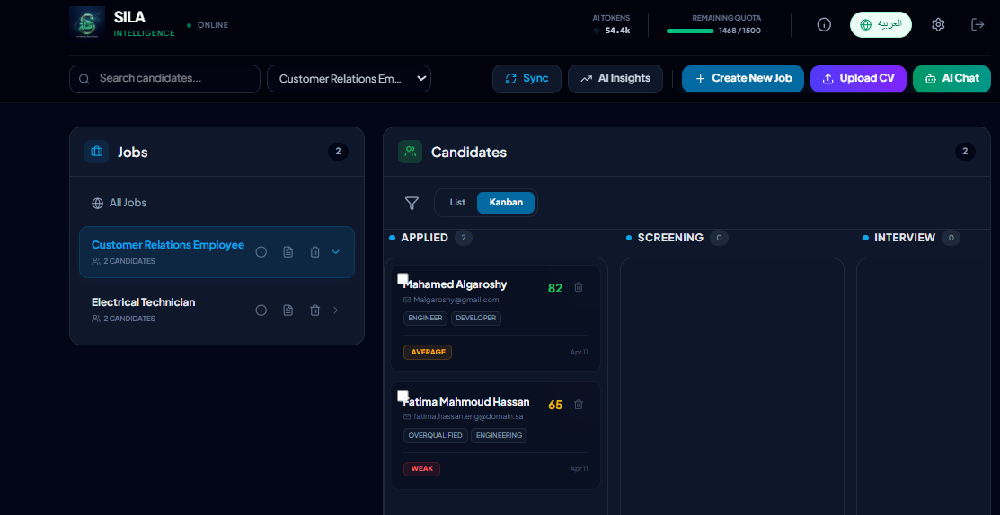
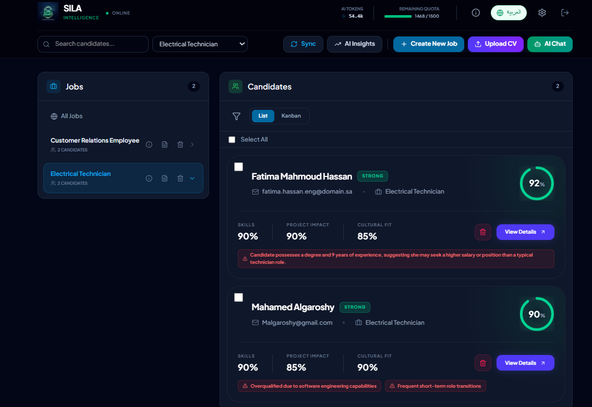
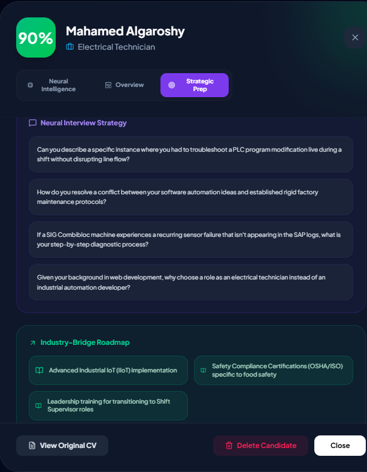
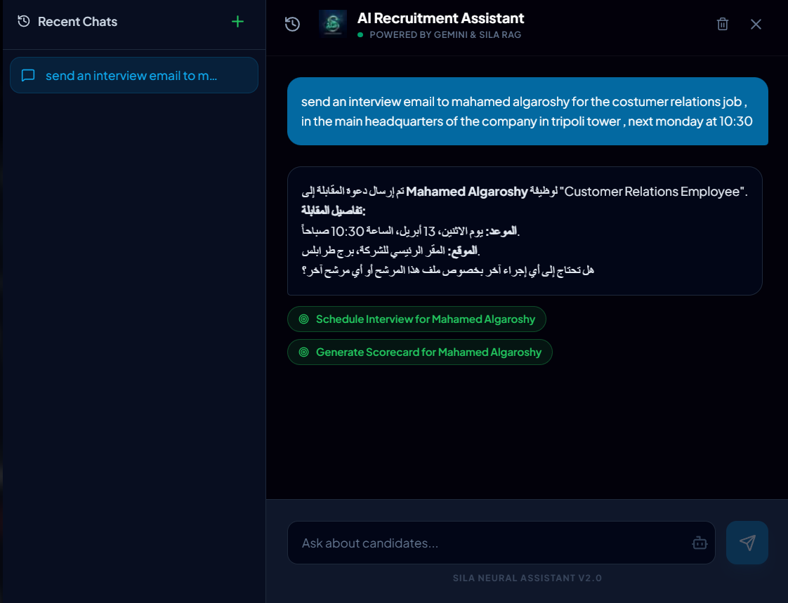
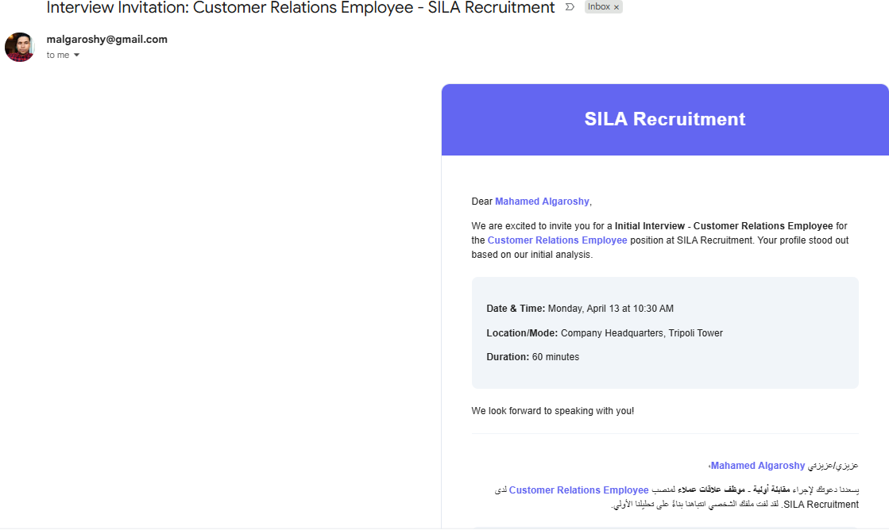
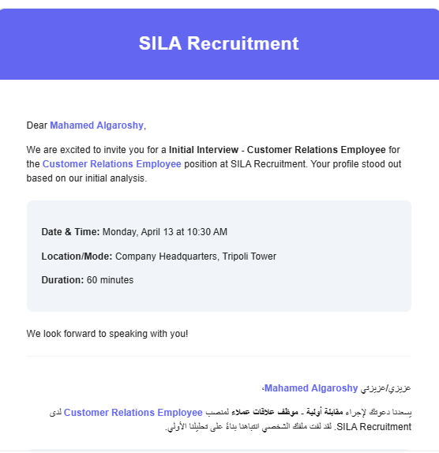
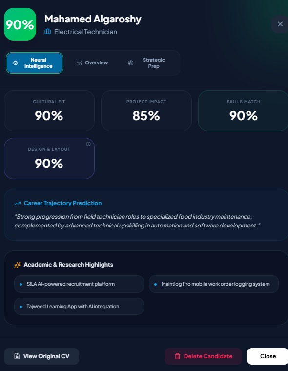
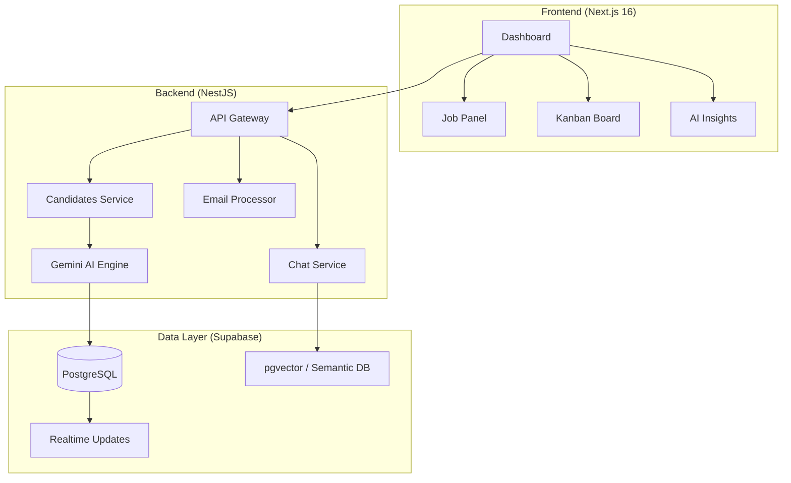

# SILA: AI Recruitment Intelligence System

[English Version](#english-version) | [النسخة العربية](#النسخة-العربية)

---

  

<h1 align="center">🚀 SILA</h1>

<strong>AI Recruitment Intelligence System</strong>

  
  
  
  

---

**SILA** is an enterprise-grade AI-powered platform designed for HR teams to automate and enhance the candidate selection process. By leveraging **Gemini 3.1 Flash Lite**, it transforms raw resume data into deep recruitment intelligence, providing explainable scores and semantic search capabilities.

### 🧠 The AI Recruitment Brain

*   **Deep Analysis**: Multi-dimensional scoring evaluating **Skills, GPA, Language, and Cultural Fit** with automated justifications.
*   **Explainable Decisions**: AI-generated reports highlighting strengths, weaknesses, and direct hiring recommendations.
*   **Multimodal Processing**: High-fidelity text extraction from **PDF, DOCX**, and images using Gemini's multimodal vision.

### 📥 Intelligent Automation

*   **Email Integration**: Automated CV collection from Gmail and Outlook via secure OAuth2 pipelines.
*   **AI Job Architect**: Generate production-ready job descriptions from simple natural language inputs.
*   **Executive Reporting**: Board-ready PDF exports with ranked candidate shortlists and scoring breakdowns.

### 📊 Advanced Analytics & RAG

*   **Real-time Insights**: Track hiring performance, token consumption, and operational costs on a high-density dashboard.
*   **Semantic RAG Search**: Query huge candidate pools using natural language (e.g., *"Find experienced AI engineers with industrial background"*).
*   **Kanban Workflow**: Visual, drag-and-drop pipeline management from application to final offer.

### 🖼️ Visual Walkthrough

| Dashboard & Kanban | Candidate Scoring |
| :--- | :--- |
|  |  |
| *Visualizing the recruitment funnel with Kanban* | *Multi-dimensional scoring and analysis* |

| AI Reasoning & Analysis | Strategic Interview Prep |
| :--- | :--- |
|  |  |
| *Explainable AI showing reasoning chains* | *Context-aware interview questions and roadmaps* |

| AI Agent & Chat | Email Integration |
| :--- | :--- |
|  |  |
| *Bilingual AI Assistant for candidate interaction* | *Seamless Gmail/Outlook automation* |

| Bilingual Reports | Neural Intelligence |
| :--- | :--- |
|  |  |
| *Professional reports in English & Arabic* | *Deep profile insights and trajectory prediction* |

### 🏗️ Architecture

### 🛠️ Tech Stack

*   **Core**: Next.js 16 (App Router), React 19, TypeScript
*   **Styling**: Tailwind CSS v4 (CSS-first configuration)
*   **Backend**: NestJS, Puppeteer (for PDF generation), Nodemailer
*   **AI**: Gemini 3.1 Flash Lite, LangChain (RAG)
*   **Database**: Supabase (PostgreSQL, Vector Search, Auth, Storage)

---

  

<h1 align="center">🚀 نظام SILA الذكي</h1>

<strong>نظام ذكاء التوظيف المعزز بالذكاء الاصطناعي</strong>

---

**SILA** هو نظام احترافي مدعوم بالذكاء الاصطناعي، مصمم خصيصاً لفرق الموارد البشرية لأتمتة وتحسين عملية اختيار المرشحين. من خلال دمج تقنيات **Gemini 3.1**، يقوم النظام بتحويل السير الذاتية المعقدة إلى رؤى استراتيجية تدعم اتخاذ القرار.

### 🧠 عقل التوظيف الذكي

*   **التحليل العميق**: تقييم متعدد الأبعاد يشمل **المهارات، المعدل، اللغات، والجاهزية المهنية** مع مبررات آلية.
*   **قرارات مفسرة**: تقارير مولدة آلياً توضح نقاط القوة والضعف وتوصيات التوظيف المباشرة.
*   **المعالجة الذكية للمستندات**: استخراج نصوص عالي الدقة من ملفات **PDF، DOCX**، والصور باستخدام رؤية Gemini الحاسوبية.

### 📥 الأتمتة والتقارير الاحترافية

*   **الربط مع البريد الإلكتروني**: جمع السير الذاتية تلقائياً من Gmail و Outlook عبر بروتوكولات OAuth2 الآمنة.
*   **مهندس الوظائف الذكي**: توليد وصف وظيفي محترف من مدخلات بسيطة بلغة طبيعية.
*   **التقارير التنفيذية**: تصدير ملفات PDF احترافية تعرض تصنيفات المرشحين وتفاصيل التقييم لمشاركتها مع الإدارة.

### 📊 التحليلات المتقدمة والبحث الدلالي

*   **لوحة الرؤى اللحظية**: تتبع أداء التوظيف، استهلاك الرموز، وتكاليف العمليات عبر لوحة تحكم متطورة.
*   **البحث الدلالي (RAG)**: ابحث في قاعدة بيانات المرشحين باستخدام اللغة الطبيعية (مثال: *"ابحث عن مهندسين ذكاء اصطناعي ذوي خبرة صناعية"*).
*   **إدارة مراحل التوظيف**: مسار توظيف مرئي يعتمد على السحب والإفلات لإدارة المرشحين من التقديم حتى العرض الوظيفي.

### 🖼️ معرض الصور الملحق

| لوحة التحكم وكانبان | تقييم المرشحين |
| :--- | :--- |
|  |  |
| *عرض مسار التوظيف باستخدام نظام كانبان* | *نظام تقييم وتصنيف متعدد الأبعاد* |

| تحليل الذكاء الاصطناعي | التحضير الاستراتيجي للمقابلات |
| :--- | :--- |
|  |  |
| *توضيح آلية اتخاذ القرار وسلسلة التفكير* | *أسئلة مقابلة مخصصة وخرائط طريق مهنية* |

| المساعد الذكي والدردشة | التكامل مع البريد الإلكتروني |
| :--- | :--- |
|  |  |
| *مساعد ذكي ثنائي اللغة للتفاعل مع البيانات* | *أتمتة كاملة مع Gmail و Outlook* |

| التقارير ثنائية اللغة | الذكاء العصبي |
| :--- | :--- |
|  |  |
| *تقارير احترافية باللغتين العربية والإنجليزية* | *تحليلات عميقة للملف الشخصي وتنبؤات المسار الوظيفي* |

---
*صُنع بكل حب بواسطة فريق SILA*

