# SILA: AI Recruitment Intelligence System

[English Version](#english-version) | [النسخة العربية](#النسخة-العربية)

---

  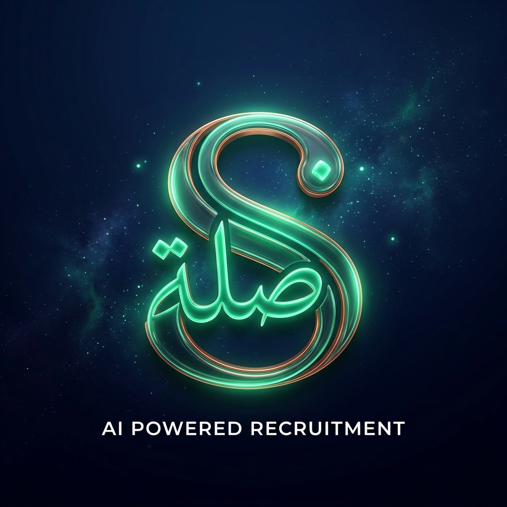

<h1 align="center">🚀 SILA</h1>

<strong>AI Recruitment Intelligence System</strong>

  
  
  
  

---

**SILA** is an enterprise-grade AI-powered platform designed for HR teams to automate and enhance the candidate selection process. By leveraging **Gemini 3.1 Flash Lite**, it transforms raw resume data into deep recruitment intelligence, providing explainable scores and semantic search capabilities.

### 🧠 The AI Recruitment Brain

*   **Deep Analysis**: Multi-dimensional scoring evaluating **Skills, GPA, Language, and Cultural Fit** with automated justifications.
*   **Explainable Decisions**: AI-generated reports highlighting strengths, weaknesses, and direct hiring recommendations.
*   **Multimodal Processing**: High-fidelity text extraction from **PDF, DOCX**, and images using Gemini's multimodal vision.

### 📥 Intelligent Automation

*   **Email Integration**: Automated CV collection from Gmail and Outlook via secure OAuth2 pipelines.
*   **AI Job Architect**: Generate production-ready job descriptions from simple natural language inputs.
*   **Executive Reporting**: Board-ready PDF exports with ranked candidate shortlists and scoring breakdowns.

### 📊 Advanced Analytics & RAG

*   **Real-time Insights**: Track hiring performance, token consumption, and operational costs on a high-density dashboard.
*   **Semantic RAG Search**: Query huge candidate pools using natural language (e.g., *"Find experienced AI engineers with industrial background"*).
*   **Kanban Workflow**: Visual, drag-and-drop pipeline management from application to final offer.

### 💬 WhatsApp CV Verification

*   **Automated Verification**: AI bot contacts candidates via WhatsApp to verify CV claims through rapid-fire Q&A.
*   **Libyan Arabic Voice**: Speaks natural Libyan dialect (بلهجة ليبية), with bilingual EN/AR fallback.
*   **Anti-Cheat Detection**: Multi-signal AI analysis flags copy-pasted responses, suspicious timing, and fabricated experience.
*   **Pipeline Integration**: Dedicated Kanban stage with "Verify via WhatsApp" button, per-question analysis, and authenticity score (0-100).

### 🖼️ Visual Walkthrough

#### 1. Smart Ingestion & Job Management
| Dashboard & Pipeline | CV Upload & Analysis |
| :--- | :--- |
| 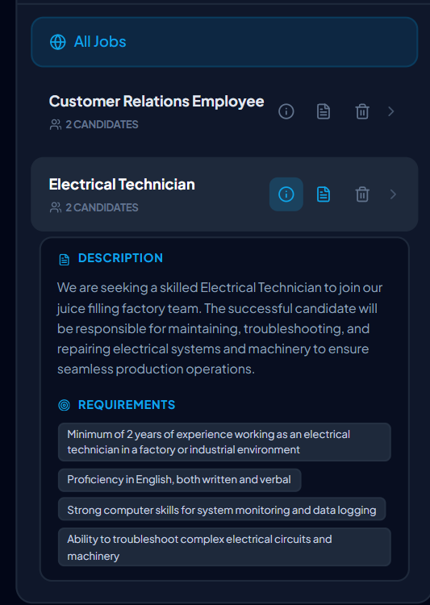 | 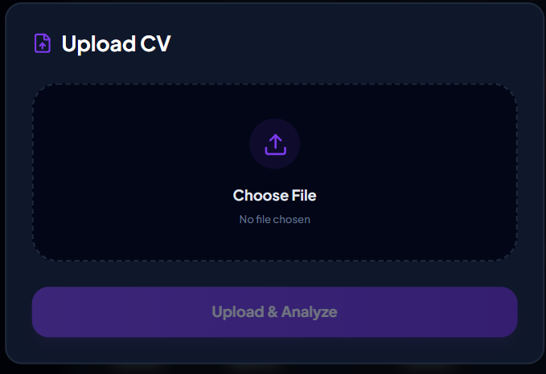 |
| *Managing recruitment pipelines and job requirements* | *High-fidelity CV processing and multi-dimensional scoring* |

#### 2. AI Intelligence & Comparative Analysis
| AI Reasoning Chains | Comparative Insights |
| :--- | :--- |
| 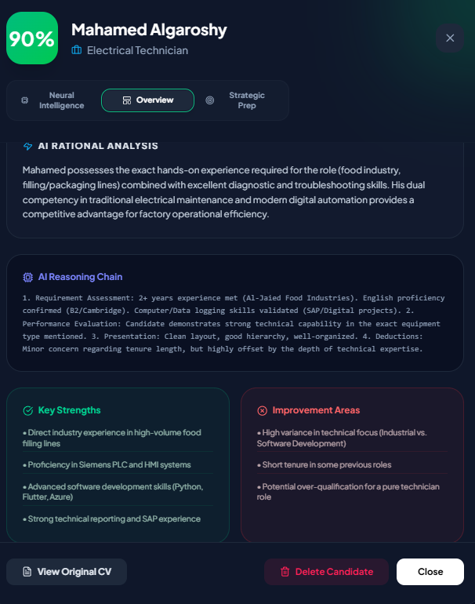 | 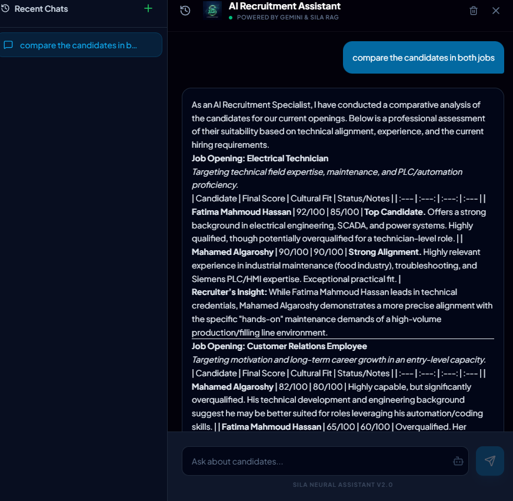 |
| *Explainable AI showing deep reasoning and justifications* | *Side-by-side candidate evaluations and rankings* |

#### 3. Automation & Communication
| AI Intelligence Assistant | Exceptional Candidate Alert |
| :--- | :--- |
| 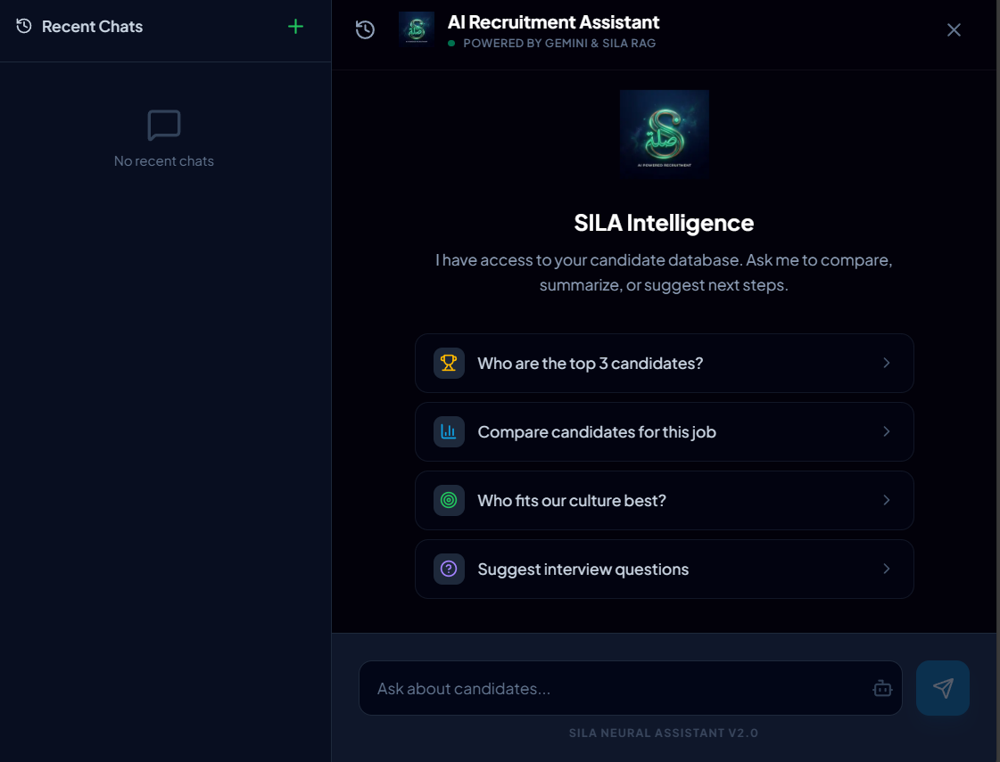 | 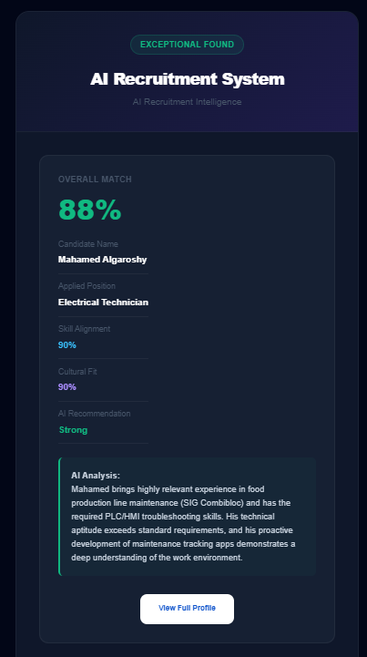 |
| *Autonomous candidate interaction and data extraction* | *Premium automated alerts for top-tier matches* |

#### 4. Infrastructure & Personalization
| AI Job Architect | Global Settings |
| :--- | :--- |
| 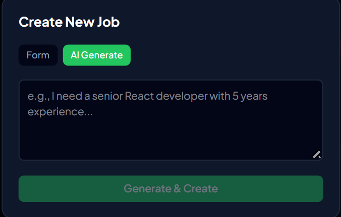 | 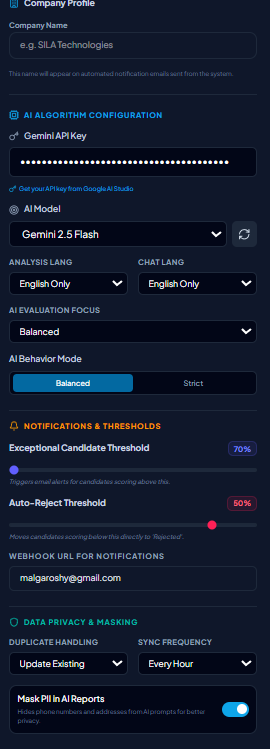 |
| *Generating precision JDs from natural language* | *Configuring localization and AI behavior preferences* |

#### 5. Executive Reporting (Localized)
| Job Summary Report | Candidate localized Report |
| :--- | :--- |
| 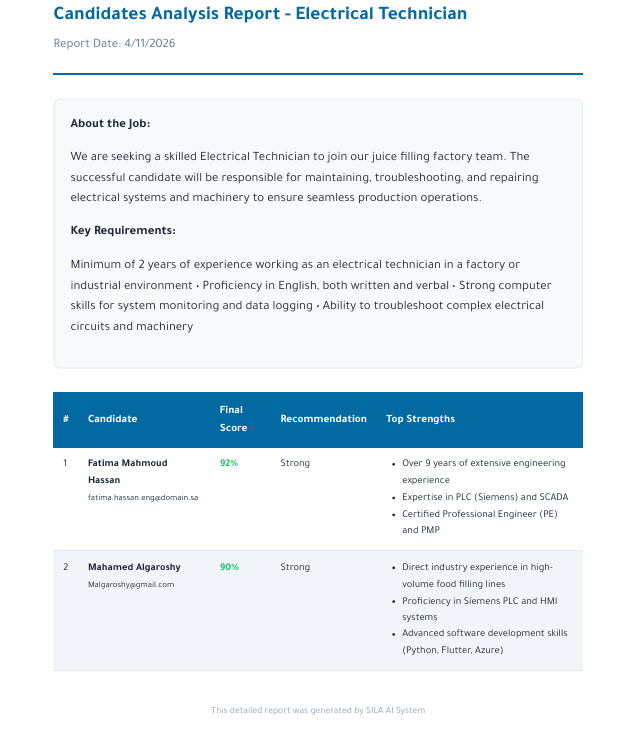 | 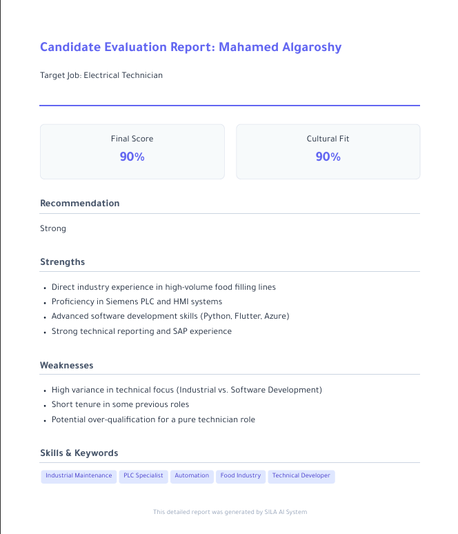 |
| *Bilingual job-wide analytics and rankings* | *Detailed candidate assessment in the chosen language* |

### 🏗️ Architecture

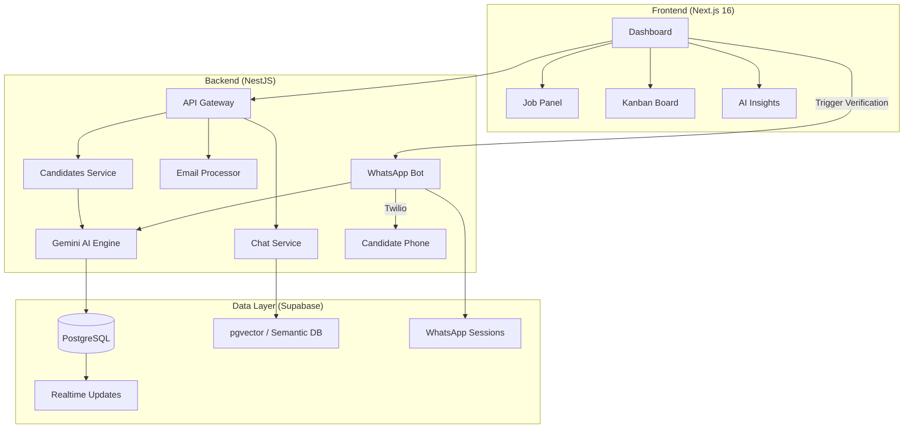

### 🛠️ Tech Stack

*   **Core**: Next.js 16 (App Router), React 19, TypeScript
*   **Styling**: Tailwind CSS v4 (CSS-first configuration)
*   **Backend**: NestJS, Puppeteer (for PDF generation), Nodemailer
*   **AI**: Gemini 3.1 Flash Lite, LangChain (RAG)
*   **Database**: Supabase (PostgreSQL, Vector Search, Auth, Storage)
*   **Messaging**: Twilio WhatsApp API (Sandbox / Business API)

---

  

<h1 align="center">🚀 نظام SILA الذكي</h1>

<strong>نظام ذكاء التوظيف المعزز بالذكاء الاصطناعي</strong>

---

**SILA** هو نظام احترافي مدعوم بالذكاء الاصطناعي، مصمم خصيصاً لفرق الموارد البشرية لأتمتة وتحسين عملية اختيار المرشحين. من خلال دمج تقنيات **Gemini 3.1**، يقوم النظام بتحويل السير الذاتية المعقدة إلى رؤى استراتيجية تدعم اتخاذ القرار.

### 🧠 عقل التوظيف الذكي

*   **التحليل العميق**: تقييم متعدد الأبعاد يشمل **المهارات، المعدل، اللغات، والجاهزية المهنية** مع مبررات آلية.
*   **قرارات مفسرة**: تقارير مولدة آلياً توضح نقاط القوة والضعف وتوصيات التوظيف المباشرة.
*   **المعالجة الذكية للمستندات**: استخراج نصوص عالي الدقة من ملفات **PDF، DOCX**، والصور باستخدام رؤية Gemini الحاسوبية.

### 📥 الأتمتة والتقارير الاحترافية

*   **الربط مع البريد الإلكتروني**: جمع السير الذاتية تلقائياً من Gmail و Outlook عبر بروتوكولات OAuth2 الآمنة.
*   **مهندس الوظائف الذكي**: توليد وصف وظيفي محترف من مدخلات بسيطة بلغة طبيعية.
*   **التقارير التنفيذية**: تصدير ملفات PDF احترافية تعرض تصنيفات المرشحين وتفاصيل التقييم لمشاركتها مع الإدارة.

### 📊 التحليلات المتقدمة والبحث الدلالي

*   **لوحة الرؤى اللحظية**: تتبع أداء التوظيف، استهلاك الرموز، وتكاليف العمليات عبر لوحة تحكم متطورة.
*   **البحث الدلالي (RAG)**: ابحث في قاعدة بيانات المرشحين باستخدام اللغة الطبيعية (مثال: *"ابحث عن مهندسين ذكاء اصطناعي ذوي خبرة صناعية"*).
*   **إدارة مراحل التوظيف**: مسار توظيف مرئي يعتمد على السحب والإفلات لإدارة المرشحين من التقديم حتى العرض الوظيفي.

### 💬 التحقق عبر واتساب (صلة)

*   **تحقق آلي**: بوت ذكي يتواصل مع المرشحين عبر واتساب للتحقق من صحة بيانات السيرة الذاتية عبر أسئلة سريعة.
*   **بلهجة ليبية طبيعية**: البوت يتحدث باللهجة الليبية الدارجة، مع دعم التبديل للغة الإنجليزية.
*   **كشف التزييف**: تحليل متعدد الإشارات لاكتشاف الإجابات المنسوخة من النت والردود غير الطبيعية.
*   **متكامل مع مسار التوظيف**: مرحلة مخصصة في كانبان مع زر "تحقق عبر واتساب" وتقرير تحليل لكل سؤال.

### 🖼️ معرض الصور الملحق

#### 1. الإدارة الذكية للوظائف والبيانات
| لوحة التحكم والمهام | رفع وتحليل السير الذاتية |
| :--- | :--- |
|  |  |
| *إدارة مسارات التوظيف ومتطلبات الوظائف المفتوحة* | *معالجة ذكية للسير الذاتية وتقييم متعدد الأبعاد* |

#### 2. ذكاء التقييم والتحليل المقارن
| سلاسل تفكير الذكاء الاصطناعي | رؤى التحليل المقارن |
| :--- | :--- |
|  |  |
| *ذكاء اصطناعي مفسر يوضح آليات التقييم والمبررات* | *تقييمات مقارنة بين المرشحين لتسهيل المفاضلة* |

#### 3. الأتمتة والتواصل الذكي
| مساعد الذكاء الاصطناعي | تنبيه المرشح الاستثنائي |
| :--- | :--- |
|  |  |
| *تفاعل تلقائي مع المرشحين واستخراج البيانات* | *تنبيهات تلقائية متميزة للمرشحين المتميزين* |

#### 4. البنية التحتية والتخصيص
| مهندس الوظائف الذكي | الإعدادات العامة |
| :--- | :--- |
|  |  |
| *توليد وصف وظيفي دقيق من اللغة الطبيعية* | *تخصيص إعدادات اللغة وتفضيلات سلوك النظام* |

#### 5. التقارير التنفيذية (المعربة)
| تقرير ملخص الوظيفة | تقرير المرشح المترجم |
| :--- | :--- |
|  |  |
| *تحليلات شاملة للوظيفة باللغتين العربية والإنجليزية* | *تقييم تفصيلي للمرشح باللغة المختارة* |

---
*صُنع بكل حب بواسطة فريق SILA*

