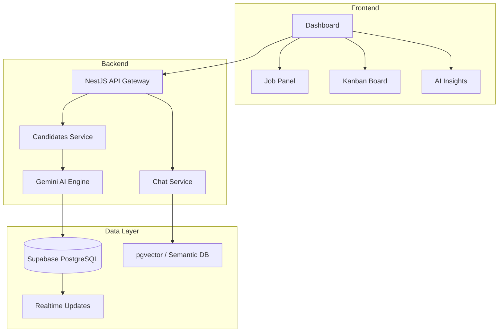
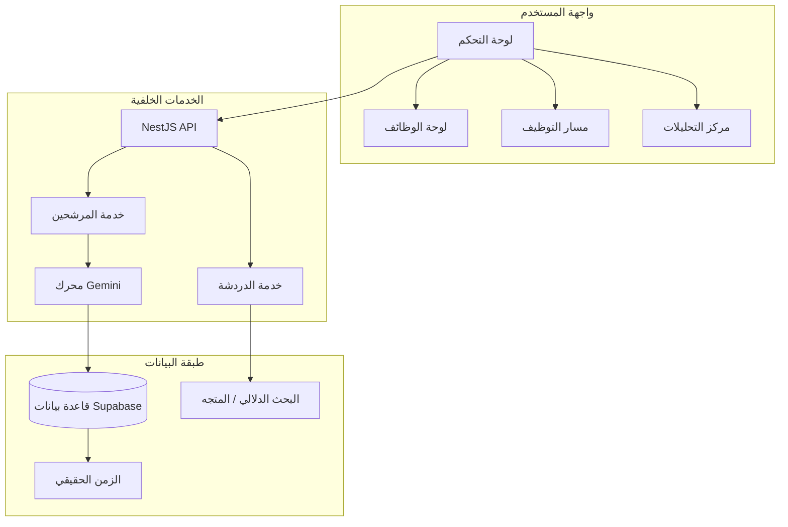

# AI Recruitment Intelligence System (ARIS)

[English Version](#english-version) | [النسخة العربية](#النسخة-العربية)

---

# 🚀 AI Recruitment Intelligence System (ARIS)

**ARIS** is an advanced, AI-powered platform designed for modern HR teams to collect, analyze, rank, and select candidates with unprecedented precision. By leveraging the **Gemini 2.0 Flash API**, it transforms raw CV data into actionable recruitment intelligence.

### 🧠 The AI Recruitment Brain

*   **Deep Analysis**: Multi-score system evaluating **Skills, GPA, Language Proficiency, and Industrial Readiness** with contextual justifications.
*   **Explainable Decisions**: AI-generated strengths, weaknesses, and hiring recommendations for every candidate.
*   **Multimodal OCR**: High-accuracy text extraction from **PDF, DOCX**, and images (**JPG, PNG**) using Gemini Multimodal.

### 📥 Intelligent Automation

*   **Automated Collection**: Integrated Gmail & Outlook scanning via OAuth2 to auto-ingest incoming CVs.
*   **AI Job Generation**: Create structured, professional job descriptions from simple natural language prompts.
*   **Executive Reporting**: Professional, board-ready PDF exports showing ranked candidates and scoring breakdowns.

### 📊 Advanced Analytics & Pool Search

*   **Insights Dashboard**: Full-width professional analytics tracking performance, token usage, and operational costs.
*   **Semantic RAG Search**: Query your candidate pool using natural language ("Find the top 3 seniors ready for interview").
*   **Kanban Pipeline**: Visual drag-and-drop management of candidate stages (Applied → Interview → Offered).

### ⚙️ Personalization & Privacy

*   **Smart Thresholds**: Automated alerts for exceptional candidates (90%+) and custom auto-rejection rules.
*   **AI Behavior Modes**: Toggle between **Strict** (high precision) and **Balanced** (looser matching) evaluation logic.
*   **PII Masking**: Integrated privacy controls to hide sensitive candidate data from AI prompts.

### 🏗️ Architecture

### 🛠️ Tech Stack

*   **Frontend**: Next.js 15, Tailwind CSS v4, next-intl, Recharts
*   **Backend**: NestJS, Puppeteer, Nodemailer
*   **AI/ML**: Gemini 2.0 Flash, pgvector
*   **Infrastructure**: Supabase (Database, Auth, Storage, Realtime)

---
*Built with ❤️ by the AI Recruitment Team*

---

# 🚀 نظام ذكاء التوظيف الاصطناعي (ARIS)

**ARIS** هي منصة متطورة مدعومة بالذكاء الاصطناعي، مصممة خصيصاً لفرق الموارد البشرية لجمع وتصنيف واختيار الكفاءات بدقة واحترافية. من خلال دمج تقنيات **Gemini**، يقوم النظام بتحويل السير الذاتية المعقدة إلى بيانات استراتيجية تدعم اتخاذ القرار. 

### 🧠 عقل التوظيف الذكي

*   **التحليل العميق**: نظام تقييم شامل يشمل **المهارات، المعدل، إتقان اللغات، والجاهزية المهنية** مع مبررات منطقية لكل بنك.
*   **قرارات مفسرة**: توليد آلي لنقاط القوة والضعف وتوصيات التوظيف المباشرة لكل مرشح.
*   **استخراج النصوص الذكي (OCR)**: دعم ملفات **PDF، DOCX**، والصور (**JPG, PNG**) بدقة استثنائية.

### 📥 الأتمتة والتقارير الاحترافية

*   **الجمع التلقائي**: فحص البريد الإلكتروني (Gmail & Outlook) تلقائيًا لاستخراج السير الذاتية الجديدة وحفظها.
*   **توليد الوظائف بالذكاء الاصطناعي**: تحويل المتطلبات البسيطة إلى وصف وظيفي محترف وهيكلي بلمسة واحدة.
*   **تقارير تنفيذية**: تصدير ملفات PDF احترافية تعرض تصنيفات المرشحين وتفاصيل التقييم لمشاركتها مع الإدارة.

### 📊 التحليلات المتقدمة والبحث الدلالي

*   **لوحة رؤى الذكاء الاصطناعي**: واجهة تحليلية شاملة تتبع الأداء، استهلاك الرموز، وتكاليف العمليات لحظيًا.
*   **البحث الدلالي (RAG)**: ابحث في قاعدة بياناتك باستخدام اللغة الطبيعية ("ابحث عن أفضل 3 مهندسين جاهزين للمقابلة").
*   **إدارة كانبان (Kanban)**: مسار توظيف مرئي يعتمد على السحب والإفلات لإدارة مراحل المرشحين بكل سهولة.

### ⚙️ التخصيص والخصوصية

*   **تنبيهات استثنائية**: نظام تنبيه تلقائي للمرشحين المتفوقين (أعلى من 90%) وقواعد للرفض التلقائي الذكي.
*   **أنماط التقييم**: التبديل بين وضع التقييم **الصارم** و وضع التقييم **المتوازن** حسب احتياج المنشأة.
*   **حماية البيانات الحساسة**: ضوابط خصوصية لإخفاء أرقام الهواتف والعناوين لضمان أمان معلومات المرشحين.

### 🏗️ الهندسة التقنية

### 🛠️ التقنيات المستخدمة

*   **الواجهة الأمامية**: Next.js 15, Tailwind CSS v4, next-intl
*   **الخدمات الخلفية**: NestJS, Puppeteer, Nodemailer
*   **الذكاء الاصطناعي**: Gemini 2.0 Flash, pgvector
*   **البنية التحتية**: Supabase (Database, Auth, Storage, Realtime)

---
*صُنع بكل حب بواسطة فريق ذكاء التوظيف*

