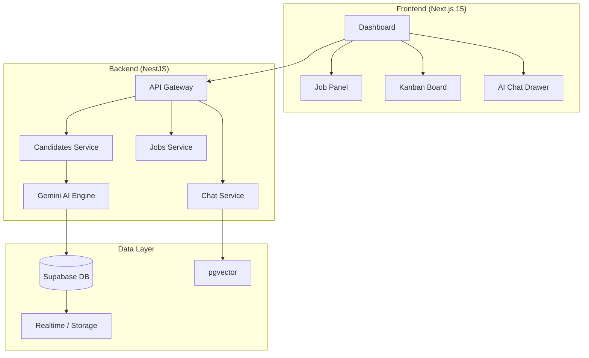

# 🚀 AI Recruitment Intelligence System (ARIS)

[](https://nextjs.org/)
[](https://nestjs.com/)
[](https://supabase.com/)
[](https://ai.google.dev/)

ARIS is an advanced, AI-powered platform designed for modern HR teams to collect, analyze, rank, and select candidates with unprecedented precision. By leveraging the **Gemini 2.0 Flash API**, it transforms raw CV data into actionable recruitment intelligence.

---

## ✨ Key Features

### 🧠 AI Recruitment Brain
- **Deep Analysis**: Multi-score system evaluating **Skills, GPA, Language Proficiency, and Industrial Readiness**.
- **Contextual Justification**: AI-generated strengths, weaknesses, and hiring recommendations for every candidate.
- **Explainable Decisions**: Quantitative scoring (0-100) backed by qualitative reasoning.

### 📥 Seamless Ingestion
- **Email Integration**: Automatically scans Gmail & Outlook for CV attachments using OAuth2.
- **Multimodal OCR**: High-accuracy text extraction from scanned PDFs and images (JPG, PNG).
- **Universal Support**: Handles PDF, DOCX, and image-based resumes.

### 💬 RAG-Powered AI Chat
- **Semantic Search**: Use natural language to query your candidate pool ("Find me the top 3 Python developers ready for a senior role").
- **Vector Database**: Grounded responses powered by `pgvector` for high scalability and accuracy.

### 📊 Recruitment Pipeline
- **Kanban Board**: Drag-and-drop candidate management (Applied → Interview → Offered → Hired).
- **Realtime Updates**: Live dashboard sync during batch uploads via Supabase Realtime.
- **Executive Reports**: Generate professional PDF reports for stake-holders using Puppeteer.

### 🌍 Global Readiness
- **Full i18n Support**: Seamlessly toggle between English and Arabic.
- **RTL Layout**: Optimized UI for Arabic users (Tajawal font) and English users (Inter font).

---

## 🏗️ Architecture



---

## 🛠️ Tech Stack

- **Core**: TypeScript, Node.js
- **Frontend**: Next.js 15 (App Router), Tailwind CSS v4, Lucide Icons, Recharts
- **Backend**: NestJS, Puppeteer (PDF Generation), Nodemailer
- **AI/ML**: Google Gemini API (2.0 Flash), `pgvector`
- **Database**: Supabase (PostgreSQL, Realtime, Auth, Storage)

---

## 🚀 Getting Started

### Prerequisites
- Node.js (v18+)
- Supabase Project (with `pgvector` enabled)
- Google Gemini API Key
- Google Cloud Console Project (for Gmail/OAuth2)

### Installation

1. **Clone the repository:**
   ```bash
   git clone https://github.com/your-repo/cv-scan.git
   cd cv-scan
   ```

2. **Install all dependencies:**
   ```bash
   npm run install:all
   ```

3. **Environment Setup:**
   Create `.env` files in both `/frontend-web` and `/backend-api` following the `.env.example` templates provided in those directories.

4. **Run Development Mode:**
   ```bash
   npm run dev:windows # For Windows
   # OR
   npm run dev # For Linux/macOS
   ```

---

## 🛤️ Roadmap

- [x] **Phase 1-3**: Core AI Engine, Email Integration, and Chat System.
- [x] **Phase 4-5**: Multi-user isolation, Kanban board, and PDF export.
- [x] **Phase 6**: Vector Search (RAG) and Multi-Language OCR.
- [ ] **Phase 7 (Current)**: Deployment Verification & SaaS scaling.
- [ ] **Future**: Mobile App (Flutter), LinkedIn Enrichment, and Microsoft Graph Integration.

---

## 📄 License
This project is licensed under the MIT License - see the [LICENSE](LICENSE) file for details.

---
*Built with ❤️ by the AI Recruitment Team*
