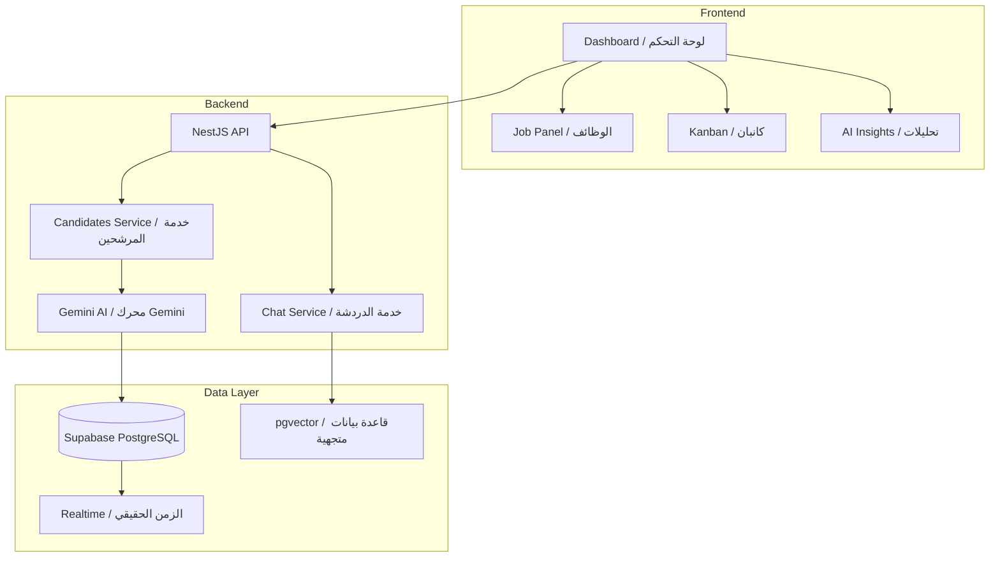

# 🚀 AI Recruitment Intelligence System (ARIS) / نظام ذكاء التوظيف الاصطناعي

---

### 🌐 Overview / نظرة عامة

**ARIS** is an advanced, AI-powered platform designed for modern HR teams to collect, analyze, rank, and select candidates with unprecedented precision. By leveraging the **Gemini 2.0 Flash API**, it transforms raw CV data into actionable recruitment intelligence.

**ARIS** منصة متطورة مدعومة بالذكاء الاصطناعي مصممة لفرق الموارد البشرية الحديثة لجمع وتحليل وتصنيف واختيار المرشحين بدقة غير مسبوقة. من خلال الاستفادة من تقنية **Gemini**، يقوم النظام بتحويل بيانات السيرة الذاتية الخام إلى رؤى توظيف قابلة للتنفيذ.

---

### 🧠 The AI Recruitment Brain / عقل التوظيف الذكي

*   **Deep Analysis (EN)**: Multi-score system evaluating Skills, GPA, Language Proficiency, and Industrial Readiness with contextual justifications.
*   **تحليل عميق (AR)**: نظام تقييم متعدد المحاور يشمل المهارات، المعدل التراكمي، إتقان اللغة، والجاهزية المهنية مع مبررات سياقية.
*   **Explainable Decisions (EN)**: AI-generated strengths, weaknesses, and hiring recommendations for every candidate.
*   **قرارات مفسرة (AR)**: نقاط القوة والضعف وتوصيات التوظيف المولدة بواسطة ذكاء اصطناعي لكل مرشح.
*   **Multimodal OCR (EN)**: Supporting PDF, DOCX, and high-accuracy text extraction from images (JPG, PNG).
*   **دعم الوسائط المتعددة (AR)**: دعم ملفات PDF و DOCX واستخراج النصوص بدقة عالية من الصور.

---

### 📊 Advanced Analytics & Pipeline / التحليلات المتقدمة ومسار التوظيف

*   **AI Insights Dashboard (EN)**: Full-width professional analytics dashboard tracking performance, token usage, and operational costs.
*   **لوحة رؤى الذكاء الاصطناعي (AR)**: لوحة تحليلات احترافية بعرض كامل لمتابعة الأداء، استهلاك الرموز (Tokens)، وتكاليف العمليات.
*   **Semantic RAG Search (EN)**: Query your candidate pool using natural language ("Find the top 3 seniors ready for interview").
*   **البحث الدلالي (AR)**: استعلم عن قاعدة بيانات المرشحين باستخدام اللغة الطبيعية ("ابحث عن أفضل 3 مهندسين جاهزين للمقابلة").
*   **Kanban Management (EN)**: Visual drag-and-drop pipeline for managing candidate stages (Applied → Interview → Offered).
*   **إدارة كانبان (AR)**: مسار توظيف مرئي يعتمد على السحب والإفلات لإدارة مراحل المرشحين (مقدم → مقابلة → عرض).

---

### ⚙️ Personalization & Privacy / التخصيص والخصوصية

*   **Smart Thresholds (EN)**: Configure automated alerts for exceptional candidates (90%+) and auto-rejection rules.
*   **تنبيهات ذكية (AR)**: تخصيص تنبيهات للمرشحين الاستثنائيين وقواعد الرفض التلقائي بناءً على معاييرك.
*   **AI Behavior Modes (EN)**: Toggle between **Strict** (no partial credit) and **Balanced** evaluation modes.
*   **أنماط سلوك الذكاء الاصطناعي (AR)**: التبديل بين وضع التقييم **الصارم** و وضع التقييم **المتوازن**.
*   **PII Masking (EN)**: Automatic privacy controls to hide sensitive candidate data (phones, addresses) from AI prompts.
*   **حماية الخصوصية (AR)**: ضوابط تلقائية لإخفاء بيانات المرشحين الحساسة لضمان أمان المعلومات.

---

### 🌍 Global Design / تصميم عالمي

*   **Full i18n & RTL (EN)**: Seamless native support for Arabic and English with professional typography (Tajawal & Inter).
*   **دعم كامل للغتين (AR)**: دعم أصلي للغتين العربية والإنجليزية مع اتجاهات واجهة مستخدم محسنة وخطوط احترافية.

---

### 🏗️ Architecture / الهندسة التقنية

---

### 🛠️ Tech Stack / التقنيات المستخدمة

*   **Frontend**: Next.js 15, Tailwind CSS v4, next-intl, Recharts
*   **Backend**: NestJS, Puppeteer, Nodemailer
*   **AI**: Gemini 2.0 Flash, pgvector
*   **Platform**: Supabase (DB, Auth, Storage, Realtime)

---
*Built with ❤️ by the AI Recruitment Team / صُنع بكل حب بواسطة فريق ذكاء التوظيف*
