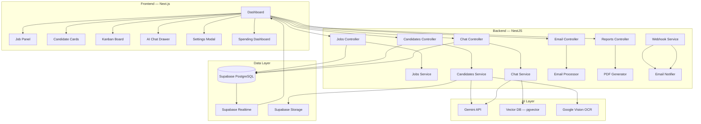

# AI Recruitment Intelligence — Roadmap

> Last updated: 2026-03-24

---

## Phase 1: Foundation ✅ *COMPLETED*

| # | Feature | PRD | Status |
|---|---------|-----|--------|
| 1 | NestJS Backend + Supabase DB | §5 | ✅ |
| 2 | Next.js Frontend (Dark Theme) | §5 | ✅ |
| 3 | Job Creation (Form) | §3.1 | ✅ |
| 4 | PDF CV Upload + AI Analysis | §3.2, §3.3 | ✅ |
| 5 | Multi-Score System (Skills, GPA, Language, Readiness, Final) | §3.3 | ✅ |
| 6 | Strengths, Weaknesses, Hiring Recommendation | §3.3 | ✅ |
| 7 | Dashboard with Ranked Candidates | §3.6 | ✅ |
| 8 | Color-Coded Scoring (Green/Yellow/Red) | §3.6 | ✅ |
| 9 | Settings Page (API Key Management) | §7 | ✅ |

---

## Phase 2: Email + i18n ✅ *COMPLETED*

| # | Feature | PRD | Status |
|---|---------|-----|--------|
| 10 | Gmail API Integration (Scan for CV attachments) | §3.2 | ✅ |
| 11 | OCR for Scanned PDFs (Gemini multimodal) | §3.2 | ✅ |
| 12 | i18n — Arabic / English with RTL | §3.6 | ✅ |
| 13 | Google Fonts (Tajawal for Arabic, Inter for English) | - | ✅ |
| 14 | Simplified CV Upload (AI auto-extracts name/email) | §3.2 | ✅ |

---

## Phase 3: AI Intelligence ✅ *COMPLETED*

| # | Feature | PRD | Status |
|---|---------|-----|--------|
| 15 | AI Chat System (Context-aware, conversation history) | §3.5 | ✅ |
| 16 | AI Job Creation from Natural Language | §3.1 | ✅ |
| 17 | Auto-Tagging (Senior, Junior, Full-Stack, etc.) | §3.7 | ✅ |
| 18 | Flag Detection (Weak CV, Overqualified, Missing Skills) | §3.7 | ✅ |
| 19 | AI Interview Question Suggestions | §3.7 | ✅ |
| 20 | AI Training Suggestions for Weak Candidates | §3.7 | ✅ |
| 21 | Full Arabic Translation (Chat, Modals, Smart Features) | - | ✅ |

---

## Phase 4: Multi-User & Settings ✅ *COMPLETED*

| # | Feature | PRD | Status |
|---|---------|-----|--------|
| 22 | Per-user data isolation (each email = separate workspace) | §7 | ✅ |
| 23 | Show connected email in Settings | §7 | ✅ |
| 24 | AI Behavior Modes (Balanced vs Strict toggle) | §3.4 | ✅ |
| 25 | PDF Report Export (Executive-level per job) | §3.8 | ✅ |

---

## Phase 5: Advanced Pipeline ✅ *COMPLETED*

| # | Feature | PRD | Est. |
|---|---------|-----|------|
| 26 | Candidate Kanban Board (Applied → Interview → Offered → Hired) | - | ✅ |
| 27 | Email Webhook Notifications for Exceptional Candidates (90%+) | - | ✅ |
| 28 | Supabase Realtime (live dashboard updates during batch upload) | - | ✅ |

---

## Phase 6: Scale & Intelligence ✅ *COMPLETED*

| # | Feature | PRD | Est. |
|---|---------|-----|------|
| 29 | Vector Database (RAG with pgvector - 768d) | - | ✅ |
| 30 | Multi-Language OCR (Using Gemini Multimodal OCR) | §3.2 | ✅ |
| 31 | DOCX & Image CV Support | §3.2 | ✅ |
| 32 | AI Spending Dashboard (Token usage + cost tracking) | - | ✅ |

---

## Deployment Verification Status

> **Status: ⚠️ PENDING VERIFICATION**

| Service | Platform | URL | Status | Notes |
|---|---|---|---|---|
| Frontend | Vercel | `[TBD]` | Pending | Waiting on build/runtime check |
| Backend | Render | `[TBD]` | Pending | Waiting on Puppeteer/Chrome check |
| Auth | Google | N/A | Pending | Need to verify OAuth redirect |

- [ ] Verify frontend build on Vercel
- [ ] Verify backend health check (`/health` or root) on Render
- [ ] Verify connectivity between Frontend and Backend (`process.env.NEXT_PUBLIC_API_URL`)
- [ ] Test Gmail/OAuth2 callback in production

---

## Phase 7: Expansion 🔮 *FUTURE (Pending Deployment Verification)*

| # | Feature | PRD | Est. |
|---|---------|-----|------|
| 33 | Outlook / Microsoft Graph Integration | §3.2 | 3h |
| 34 | LinkedIn / GitHub Profile Enrichment | §9 | 4h |
| 35 | Mobile App (Flutter) | §5 | 20h+ |
| 36 | Multi-Company SaaS Platform | §9 | 20h+ |
| 37 | Role-Based Access Control (Admin, Recruiter, Viewer) | §7 | 4h |

---

## Architecture Diagram

