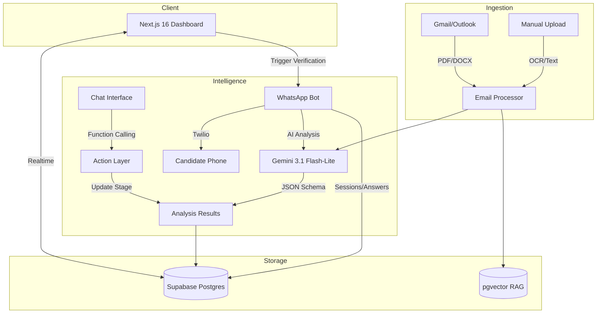

# 🗺️ SILA Strategy Roadmap (2026)

> **AI Recruitment Intelligence System**
> High-performance, AI-driven recruitment workflows for enterprise HR teams.

---

## 🚦 System Status Dashboard

| Phase | Focus Area | Progress | Status |
|:---|:---|:---|:---|
| **P1-6** | **Core Foundation** | 100% | ✅ COMPLETED |
| **P7** | **Infrastructure & Polish** | 100% | ✅ COMPLETED |
| **P8** | **AI Intelligence Layer** | 100% | ✅ COMPLETED |
| **P9** | **Enterprise Ecosystem** | 0% | ⏳ PLANNED |

---

## ✅ Completed Milestones (Phases 1-7)

<b>View Architecture & Core Integration Details</b>

### Phase 1: Foundation
- NestJS Backend & Supabase PostgreSQL
- Next.js 16 (React 19) Frontend
- Multi-score AI Analysis Engine

### Phase 2: Multi-Channel Ingestion
- Gmail OAuth2 attachment syncing
- Gemini Multimodal OCR for scanned CVs
- Bilingual Arabic/English support (RTL)

### Phase 3-6: Intelligence & Scale
- RAG-Enabled semantic search (pgvector)
- DOCX & Image support
- AI Spending & Token Usage Dashboard
- Pipeline Kanban Board

### Phase 7: Enterprise Readiness
- Microsoft Graph / Outlook Integration
- Deep Glassmorphism UI/UX Redesign
- Ultra-fast 3-stage Docker deployments
- Temporal AI Awareness (Current Date: March 27, 2026)

---

## 🚀 Completed Phase: AI Intelligence (P8)

*Focus: Scaling reliability and automation via Gemini 3.1 series.*

| # | Feature | PRD | Priority | Status |
|:---|:---|:---|:---|:---|
| 41 | **Native JSON Schema Integration** | §3.4 | P0 | ✅ DONE |
| 42 | **Actionable Chat (Function Calling)** | §3.5 | P0 | ✅ DONE |
| 42.1| **Intelligence Expansion (Batch A)** | - | P1 | ✅ DONE |
| 42.2| **Intelligence Expansion (Batch B)** | - | P1 | ✅ DONE |
| 42.3| **Intelligence Expansion (Batch C)** | - | P2 | ✅ DONE |
| 43 | **Hybrid Search RAG Optimization** | §6.1 | P1 | ✅ DONE |
| 44 | **AI Context Caching** | §6.2 | P1 | ✅ DONE |
| 45 | **Multimodal CV Layout Analysis** | §3.2 | P2 | ✅ DONE |
| 46 | **Reasoning-Based Interviews** | - | P1 | ✅ DONE |
| 47 | LinkedIn / GitHub Profile Enrichment | §9 | 4h | ⏳ |
| 48 | Mobile App Implementation (Flutter) | §5 | 20h+ | ⏳ |
| 49 | Multi-Company SaaS Platform | §9 | 20h+ | ⏳ |
| 50 | Enterprise RBAC (Admin/Recruiter/Viewer) | §7 | 4h | ⏳ |
| 51 | **WhatsApp CV Verification Bot** | - | 14h | ⏳ PLANNED |

---

## 🏗️ Technical Architecture

