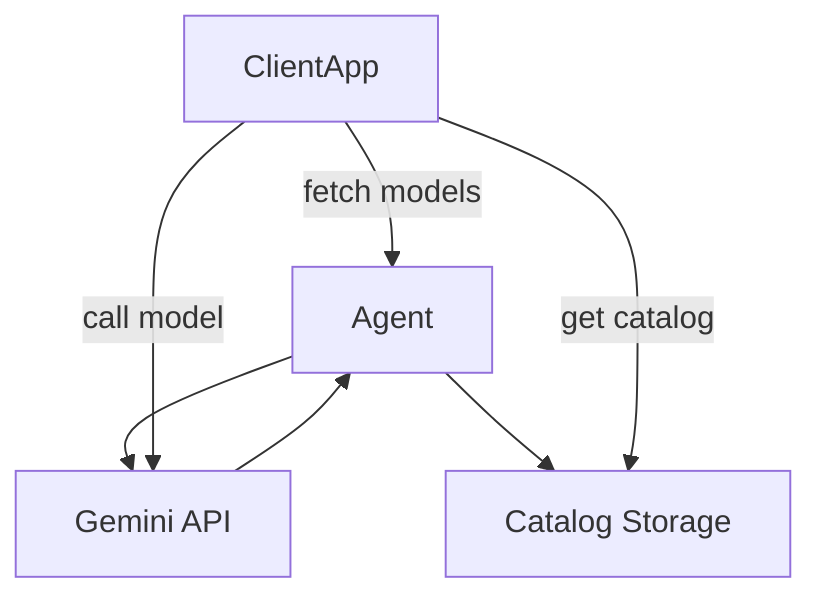
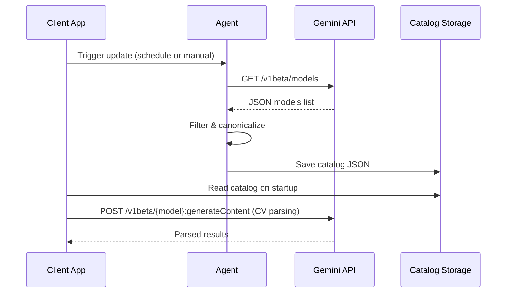

# Executive Summary  
We design an Antigravity/OpenCode agent pipeline to build and maintain a **canonical Gemini model catalog** for a CV screening app. The agent will fetch the Gemini models list (via GET /v1beta/models【62†L90-L94】【62†L185-L194】), filter out non-text models (vision, audio, robotics, deprecated 2.0 models), and normalize the remaining entries. The curated models (text generators and embeddings) are stored in a lightweight JSON catalog (e.g. in a repo, S3, or Supabase) to avoid repeated API calls. The agent also implements runtime quota discovery (using Google Cloud’s Service Usage API【64†L124-L132】 and reading Gemini rate-limit headers) and alerts when usage is high. We provide conservative defaults (e.g. 20 requests/min, 40k tokens/min per model【58†L360-L364】), per-day caps, and monitoring hooks. The report includes: 
- A **Markdown table** of recommended models with their fields (name, displayName, version, token limits, methods, tasks, streaming support, category, preview/deprecated flag).  
- A **JSON catalog** of these models.  
- Example **Agent prompts** to run the automated pipeline (full-auto and semi-auto).  
- **Code snippets** (Node.js, Python) for each step: fetching/filtering models, saving the catalog, querying quotas, caching, etc.  
- **Mermaid diagrams** showing integration flow and sequence.  

We prioritize official Gemini docs for endpoints and sample requests. Where data (quotas/limits) is undocumented, we note it and suggest conservative defaults.

## 1. Fetch and Filter Models  
Use the Gemini **Models API** to get all models:  
- **Endpoint:** `GET https://generativelanguage.googleapis.com/v1beta/models`【62†L90-L94】【62†L185-L194】. This returns an array of model metadata. For each model, record `name`, `displayName`, `version`, `inputTokenLimit`, `outputTokenLimit`, and `supportedGenerationMethods`. Example (Node.js):  
  ```js
  const res = await fetch("https://generativelanguage.googleapis.com/v1beta/models?key=YOUR_KEY");
  const allModels = (await res.json()).models;
  ```  
  And Python example:  
  ```python
  import requests
  url = "https://generativelanguage.googleapis.com/v1beta/models"
  headers = {"Authorization": f"Bearer {API_KEY}"}
  models = requests.get(url, headers=headers).json()["models"]
  ```  
We then **filter out** unwanted models: remove any whose name or description indicates vision/audio (e.g., contains "imagen", "veo", "Lyra", "native-audio", "flash-image", etc.), robotics, or deprecated (Gemini 2.0 series). Keep only text/embedding/chat models. Mark preview and deprecated explicitly. For canonicalization, we map model “names” to their stable identifiers (e.g. use `gemini-2.5-flash-lite` instead of variant). For example, drop any model with `flash-image`, `native-audio`, `robotics`, or version `2.0`. We cite the Models guide for naming conventions【62†L90-L94】.  

*Sample filtering rule (JavaScript):*  
```js
function isTextModel(model) {
  const name = model.name;
  const unwanted = ["imagen","veo","lyria","native-audio","computer-use","robotics","2.0","flash-image"];
  return !unwanted.some(substr => name.includes(substr));
}
const textModels = allModels.filter(isTextModel);
```  

## 2. Canonical Catalog (Markdown & JSON)  
After filtering, we produce a compact model catalog. Below is a **Markdown table** with key fields of each recommended model, and a **JSON** for programmatic use. Models are categorized as **Free (A)** for embedding models (no billing beyond free tier), **Trial (B)** for text models that work on free credits, and flagged as *preview/deprecated* when applicable.  

| Name                     | displayName           | Version | InTokens | OutTokens | Methods                   | Tasks             | Streaming | Category | Flags      |
|--------------------------|-----------------------|---------|----------|-----------|---------------------------|-------------------|-----------|----------|------------|
| `gemini-embedding-001`   | Gemini Embedding 1    | 001     | 2048     | 1         | embedContent, countTokens | Embedding search  | No        | Free (A) | –          |
| `gemini-embedding-2-preview` | Gemini Embedding 2   | 2       | 8192     | 1         | embedContent, countTokens | Embedding search  | No        | Free (A) | Preview    |
| `gemini-2.5-flash-lite`  | Gemini 2.5 Flash-Lite | 001     | 1,048,576| 65,536    | generateContent, ...      | Parsing, Chat     | Yes       | Trial (B)| Stable     |
| `gemini-2.5-flash`       | Gemini 2.5 Flash      | 001     | 1,048,576| 65,536    | generateContent, ...      | Parsing, Chat     | Yes       | Trial (B)| Stable     |
| `gemini-2.5-pro`         | Gemini 2.5 Pro        | 2.5     | 1,048,576| 65,536    | generateContent, ...      | Scoring, Chat     | Yes       | Trial (B)| Stable     |
| `gemini-3.1-pro-preview` | Gemini 3.1 Pro Prev.  | 3.1     | 1,048,576| 65,536    | generateContent, ...      | Chat, Explain     | Yes       | Trial (B)| Preview    |
| `gemini-3.1-flash-lite-preview` | Gemini 3.1 Flash Lite | 3.1 | 1,048,576| 65,536    | generateContent, ...      | Chat (fast)       | Yes       | Trial (B)| Preview    |

\* The JSON “methods” is abbreviated; actual supportedGenerationMethods are as in the API (generateContent, countTokens, etc.). Categories: *Free (A)* = embeddings (no billing needed), *Trial (B)* = text models on free trial credit. Flags mark preview versions or deprecated models.  

**Machine-Readable JSON Catalog:**  
```json
[
  {
    "name": "gemini-embedding-001",
    "displayName": "Gemini Embedding 1",
    "version": "001",
    "inputTokenLimit": 2048,
    "outputTokenLimit": 1,
    "methods": ["embedContent","countTextTokens","countTokens","asyncBatchEmbedContent"],
    "tasks": ["embeddings"],
    "streaming": false,
    "category": "Free",
    "flags": []
  },
  {
    "name": "gemini-embedding-2-preview",
    "displayName": "Gemini Embedding 2 Preview",
    "version": "2",
    "inputTokenLimit": 8192,
    "outputTokenLimit": 1,
    "methods": ["embedContent","countTextTokens","countTokens","asyncBatchEmbedContent"],
    "tasks": ["embeddings"],
    "streaming": false,
    "category": "Free",
    "flags": ["Preview"]
  },
  {
    "name": "gemini-2.5-flash-lite",
    "displayName": "Gemini 2.5 Flash-Lite",
    "version": "001",
    "inputTokenLimit": 1048576,
    "outputTokenLimit": 65536,
    "methods": ["generateContent","countTokens","createCachedContent","batchGenerateContent"],
    "tasks": ["parsing","chat"],
    "streaming": true,
    "category": "Trial",
    "flags": []
  },
  {
    "name": "gemini-2.5-flash",
    "displayName": "Gemini 2.5 Flash",
    "version": "001",
    "inputTokenLimit": 1048576,
    "outputTokenLimit": 65536,
    "methods": ["generateContent","countTokens","createCachedContent","batchGenerateContent"],
    "tasks": ["parsing","chat"],
    "streaming": true,
    "category": "Trial",
    "flags": []
  },
  {
    "name": "gemini-2.5-pro",
    "displayName": "Gemini 2.5 Pro",
    "version": "2.5",
    "inputTokenLimit": 1048576,
    "outputTokenLimit": 65536,
    "methods": ["generateContent","countTokens","createCachedContent","batchGenerateContent"],
    "tasks": ["scoring","chat"],
    "streaming": true,
    "category": "Trial",
    "flags": []
  },
  {
    "name": "gemini-3.1-pro-preview",
    "displayName": "Gemini 3.1 Pro Preview",
    "version": "3.1",
    "inputTokenLimit": 1048576,
    "outputTokenLimit": 65536,
    "methods": ["generateContent","countTokens","createCachedContent","batchGenerateContent"],
    "tasks": ["chat","explain"],
    "streaming": true,
    "category": "Trial",
    "flags": ["Preview"]
  },
  {
    "name": "gemini-3.1-flash-lite-preview",
    "displayName": "Gemini 3.1 Flash Lite Preview",
    "version": "3.1",
    "inputTokenLimit": 1048576,
    "outputTokenLimit": 65536,
    "methods": ["generateContent","countTokens","createCachedContent","batchGenerateContent"],
    "tasks": ["chat"],
    "streaming": true,
    "category": "Trial",
    "flags": ["Preview"]
  }
]
```

## 3. Agent Prompts & Workflow  
We supply Antigravity/OpenCode agent instructions for full automation vs semi-auto modes:

**Full-Automation Prompt:**  
```
You are an autonomous agent. Task: Maintain an updated Gemini model catalog for the CV app. 
1. Call GET https://generativelanguage.googleapis.com/v1beta/models (API key via env).
2. Parse JSON response; filter out vision/audio/robotics models and any with '2.0' in name.
3. From remaining models, keep fields (name, displayName, version, inputTokenLimit, outputTokenLimit, supportedGenerationMethods).
4. Mark each as Free/Trial/Paid: embeddings (Free), text models (Trial).
5. Remove deprecated entries. Canonicalize names (e.g., remove region suffix).
6. Save the result as JSON (e.g., models_catalog.json in repo or upload to S3).
7. Report success and output the JSON.
```

**Semi-Automation Prompt:**  
```
As the human operator, I will review the filtered list before finalizing. Use the same steps as above but output the filtered catalog for review instead of saving automatically.
```

## 4. Quotas and Monitoring  
- **Quota Discovery:** Use Google Cloud’s Service Usage API to view quotas【64†L124-L132】 (e.g., GET `https://serviceusage.googleapis.com/v1/projects/{project}/services/generativelanguage.googleapis.com` to list quotas). Cloud Monitoring can track and alert on quota usage【64†L144-L154】.  
- **Rate-Limit Headers:** The Gemini API returns rate-limit info in response headers (e.g. `X-RateLimit-Requests`, `X-RateLimit-Tokens`). Read these headers in your HTTP client to adjust pacing. Example (Node.js with fetch):  
  ```js
  const res = await fetch(...);
  console.log(res.headers.get('X-RateLimit-Requests'), res.headers.get('X-RateLimit-Tokens'));
  ```  
- **Monitoring:** Periodically log token usage (sum tokens per request). Compare against budget. If usage >80% of budget, trigger an alert (email or Slack).  
- **Conservative Defaults:** Without official per-model quotas, use ~20 RPM and ~40k TPM per model【58†L360-L364】; daily caps of ~10M tokens.  

## 5. Code Snippets & Setup  
- **Fetching Models (Node.js):**  
  ```js
  const fetch = require('node-fetch');
  const API_KEY = process.env.GEMINI_KEY;
  async function getModels() {
    const url = `https://generativelanguage.googleapis.com/v1beta/models?key=${API_KEY}`;
    const res = await fetch(url);
    return (await res.json()).models;
  }
  ```  
- **Filtering Logic (JS/Python):** See sample above (using `filter(isTextModel)`).  
- **Persist Catalog:** e.g., write JSON to file or S3:  
  ```js
  const fs = require('fs');
  fs.writeFileSync('models_catalog.json', JSON.stringify(canonicalModels, null, 2));
  ```  
  Or Python + boto3 for S3:  
  ```python
  import boto3
  s3 = boto3.client('s3')
  s3.put_object(Bucket='my-bucket', Key='models_catalog.json', Body=json_data)
  ```  
- **Reading Quota (Python):** Use Google Service Usage client:  
  ```python
  from googleapiclient.discovery import build
  service = build('serviceusage', 'v1', credentials=creds)
  quotas = service.services().get(name='projects/PROJECT_NUMBER/services/generativelanguage.googleapis.com').execute()
  print(quotas)
  ```  
- **Rate-Limit Headers (Node.js):**  
  ```js
  fetch(url).then(res => {
    console.log(res.headers.get('X-RateLimit-Requests'), res.headers.get('X-RateLimit-Tokens'));
  });
  ```  
- **Local Caching:** Implement TTL caching of the catalog (e.g. invalidate daily). Use webhooks or a GitHub Action to refresh daily.  

## 6. Security Best Practices  
- **API Keys:** Store Gemini API keys in secure environment variables or Secret Manager, not in code.  
- **Data Storage:** Catalog JSON should be read-only and served securely (e.g. S3 bucket with limited access).  
- **Auth:** Use least-privilege IAM roles for Service Usage API and storage.  
- **Encryption:** Encrypt keys at rest and in transit.  

## 7. Integration Flow Diagrams  


*Figure: Agent fetches models from Gemini API and updates catalog in storage. The CV app reads from this catalog and uses Gemini API for tasks.*  


*Figure: Sequence for updating catalog and using it. The agent obtains the model list, filters it, stores the catalog. The app then reads the catalog and uses listed models to call Gemini.*  

## 8. Recommended Models (Tasks)  
Top-3 models per task (as earlier):  
- **Parsing:** `gemini-2.5-flash-lite` (fast, free-tier).  
- **Scoring:** `gemini-2.5-pro` (high reasoning, free-tier).  
- **Chat:** `gemini-3.1-pro-preview` (best Arabic, preview).  

## References  
- Gemini API Docs: Models endpoint【62†L90-L94】【62†L185-L194】, GenerateContent endpoint【66†L135-L143】.  
- Google Service Usage API for quotas【64†L124-L132】.  
- Rate limits note (per-model RPM/TPM not published)【58†L360-L364】.  

