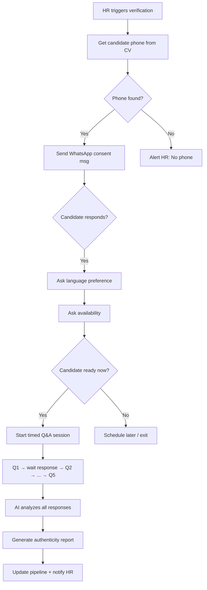
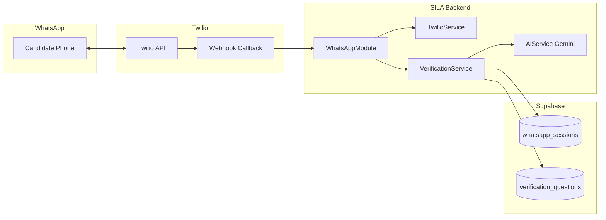

# WhatsApp Interview Verification — SILA Feature Plan

> **Status:** Phase 9 — ✅ COMPLETED (v1.0)
> **Priority:** P1
> **Est. Effort:** 14 hours
> **Deployment:** Live on Render + Vercel

---

## 1. Feature Overview

An AI-powered WhatsApp bot that contacts candidates to:
1. **Check availability** for a quick pre-interview verification
2. **Ask 3-5 rapid-fire questions** to verify CV claims are real
3. **Analyze answers** for naturalness (not copy-pasted from internet) using multi-signal AI
4. **Score authenticity** and report red flags to HR

This helps HR eliminate candidates with fabricated or exaggerated CV data before investing time in real interviews.

---

## 2. Technical Architecture

### 2.1 WhatsApp Provider: Twilio (Hybrid Approach)

| Environment | Method | Cost |
|:--|:--|:--|
| **Development** | Twilio Sandbox (free) | $0 |
| **Production** | Twilio WhatsApp Business API | ~$0.005/msg |

**Why Twilio over Baileys:**
- No risk of WhatsApp account ban
- No 24/7 phone number running on server
- No QR code re-auth sessions
- Built-in webhook for incoming messages
- Sandbox allows free development/testing

### 2.2 System Flow



### 2.3 Infrastructure Diagram



---

## 3. Database Schema

### 3.1 New Table: `whatsapp_verification_sessions`

```sql
CREATE TABLE public.whatsapp_verification_sessions (
    id UUID PRIMARY KEY DEFAULT gen_random_uuid(),
    application_id UUID NOT NULL REFERENCES applications(id) ON DELETE CASCADE,
    candidate_id UUID NOT NULL REFERENCES candidates(id),
    job_id UUID NOT NULL REFERENCES jobs(id),
    user_email TEXT NOT NULL,

    -- WhatsApp contact
    phone_number TEXT NOT NULL,
    twilio_message_sid TEXT,

    -- Session state
    status TEXT NOT NULL DEFAULT 'pending'
        CHECK (status IN ('pending','consent_requested','language_selected','availability_check','in_progress','completed','expired','candidate_declined')),
    current_question_index INTEGER DEFAULT 0,

    -- Language
    preferred_language TEXT DEFAULT 'ar' CHECK (preferred_language IN ('ar','en')),

    -- Availability
    is_available_now BOOLEAN,
    scheduled_time TIMESTAMPTZ,

    -- Analytics
    session_started_at TIMESTAMPTZ,
    session_ended_at TIMESTAMPTZ,

    -- AI Results
    authenticity_score NUMERIC(5,2),        -- 0-100
    authenticity_verdict TEXT,               -- 'genuine', 'suspicious', 'likely_fabricated'
    red_flags JSONB DEFAULT '[]',            -- [{reason, severity}]
    summary TEXT,

    created_at TIMESTAMPTZ DEFAULT now(),
    updated_at TIMESTAMPTZ DEFAULT now()
);
```

### 3.2 New Table: `verification_questions`

```sql
CREATE TABLE public.verification_questions (
    id UUID PRIMARY KEY DEFAULT gen_random_uuid(),
    session_id UUID NOT NULL REFERENCES whatsapp_verification_sessions(id) ON DELETE CASCADE,
    question_number INTEGER NOT NULL,
    question_text TEXT NOT NULL,
    question_context TEXT,        -- What CV claim this verifies
    expected_topics TEXT[],

    -- Candidate response
    answer_text TEXT,
    answered_at TIMESTAMPTZ,
    response_delay_ms INTEGER,

    -- AI analysis per question
    naturalness_score NUMERIC(5,2),
    consistency_score NUMERIC(5,2),
    copy_paste_likelihood NUMERIC(5,2),
    ai_notes TEXT,

    created_at TIMESTAMPTZ DEFAULT now()
);
```

### 3.3 New Pipeline Stage

```sql
ALTER TABLE applications
  DROP CONSTRAINT IF EXISTS applications_pipeline_stage_check,
  ADD CONSTRAINT applications_pipeline_stage_check
    CHECK (pipeline_stage IN ('screening','whatsapp_verification','interview','offered','hired','rejected'));
```

### 3.4 New Settings Keys

```sql
-- Per-user settings stored in settings table
whatsapp_enabled            TEXT DEFAULT 'false'
whatsapp_twilio_sid         TEXT DEFAULT ''
whatsapp_twilio_token       TEXT DEFAULT ''
whatsapp_twilio_from        TEXT DEFAULT ''
whatsapp_question_count     TEXT DEFAULT '4'
whatsapp_timeout_minutes    TEXT DEFAULT '3'
```

### 3.5 Indexes & RLS

```sql
CREATE INDEX idx_whatsapp_sessions_user ON whatsapp_verification_sessions(user_email);
CREATE INDEX idx_whatsapp_sessions_candidate ON whatsapp_verification_sessions(candidate_id);
CREATE INDEX idx_whatsapp_sessions_status ON whatsapp_verification_sessions(status);

ALTER TABLE whatsapp_verification_sessions ENABLE ROW LEVEL SECURITY;
ALTER TABLE verification_questions ENABLE ROW LEVEL SECURITY;

CREATE POLICY "Users own their sessions" ON whatsapp_verification_sessions
    FOR ALL USING (user_email = auth.email());
```

---

## 4. Backend Implementation

### 4.1 New Module: `WhatsAppModule`

```
backend-api/src/whatsapp/
├── whatsapp.module.ts
├── whatsapp.controller.ts    -- REST endpoints + Twilio webhook
├── whatsapp.service.ts       -- Core WhatsApp send/receive logic
├── verification.service.ts   -- Q&A session orchestration
└── twilio.service.ts         -- Twilio API wrapper (sandbox/production)
```

### 4.2 `TwilioService` — Key Methods

| Method | Purpose |
|:--|:--|
| `sendMessage(to, body)` | Send WhatsApp text message via Twilio |
| `sendQuickReply(to, body, options[])` | Send message with interactive buttons |
| `verifyWebhookSignature(payload, signature)` | Validate incoming Twilio webhooks |
| `getSandboxConfig()` | Return Twilio sandbox join code for dev |

**New dependency:**
```json
"twilio": "^5.x"
```

### 4.3 `VerificationService` — State Machine

```
PENDING → CONSENT_REQUESTED → LANGUAGE_SELECTED → AVAILABILITY_CHECK → IN_PROGRESS → COMPLETED
                                                                         ↘ EXPIRED
                                                                         ↘ CANDIDATE_DECLINED
```

| Method | Trigger | Action |
|:--|:--|:--|
| `startVerification(applicationId, userEmail)` | HR action | Extract phone, create session, send consent message |
| `handleIncomingMessage(fromPhone, body)` | Twilio webhook | Route to correct state handler |
| `handleConsentResponse(session, answer)` | Candidate reply | If yes → ask language; if no → mark declined |
| `handleLanguageSelection(session, answer)` | Candidate reply | Store preference, ask availability |
| `handleAvailabilityResponse(session, answer)` | Candidate reply | If now → generate questions; if later → schedule |
| `generateQuestions(session)` | Pre-Q&A | Gemini creates 3-5 unique questions from CV+job |
| `handleQuestionResponse(session, answer)` | Candidate reply | Record answer + timing, next question or conclude |
| `analyzeSession(session)` | After all answers | Full Gemini multi-signal analysis |
| `generateReport(session)` | Post-analysis | Create authenticity report for HR |

### 4.4 AI Question Generation Prompt (Gemini)

```text
You are an expert recruitment fraud detector. Generate {question_count} rapid-fire
verification questions for a candidate who claims the following CV details:

=== CV Summary ===
{cv_summary}

=== Job Applied For ===
{job_title}: {job_requirements}

=== Question Design Rules ===
1. Questions must verify REAL experience, not textbook knowledge
2. Ask about specifics that appear in their CV (projects, tools, years)
3. Make questions hard to answer via Google search
   (e.g., "Tell me about YOUR specific implementation of X" not "What is X?")
4. Keep each question under 2 sentences
5. Questions must be in {language} language
6. Mix question types: behavioral, technical specifics, situational

=== Output Format (JSON) ===
Return ONLY:
{
  "questions": [
    {
      "text": "Question in {language}",
      "verifies": "Which CV claim this targets",
      "expected_topics": ["topic1", "topic2"]
    }
  ]
}
```

### 4.5 AI Authenticity Analysis Prompt (Gemini)

```text
You are an expert recruitment fraud analyst. Analyze this candidate's WhatsApp
verification session to determine if their CV claims are genuine.

=== Candidate CV Summary ===
{cv_text}

=== Verification Session ===
{questions_and_answers_with_timestamps}

=== Analysis Instructions ===
Analyze for authenticity using these signals:

1. **Response Timing Analysis:**
   - Compare answer length (chars) vs response delay (seconds)
   - Flag if complex 200+ char answers arrive in <5 seconds (likely copy-paste)
   - Flag if all answers arrive at nearly identical times (scheduled/scripted)

2. **Linguistic Naturalness:**
   - Is the language conversational or formal/academic?
   - Does it sound like spoken language or written documentation?
   - Are there personal anecdotes ("I", "my team", "we built") or generic statements?

3. **CV Consistency:**
   - Do the details in answers match CV claims precisely?
   - Are years, tool names, project details consistent?
   - Does the candidate show depth beyond what's written in CV?

4. **Internet-Like Patterns:**
   - Does the answer read like a Wikipedia/Medium/GeeksforGeeks article?
   - Are there definition-style openings ("X is a framework that...")?
   - Is the vocabulary unnaturally precise or buzzword-heavy?

5. **Behavioral Signals:**
   - Did candidate ask clarifying questions? (genuine)
   - Did candidate push back on any question? (genuine)
   - Was every answer compliant and eager? (suspicious)

=== Output Format (JSON) ===
{
  "per_question_analysis": [
    {
      "question_number": 1,
      "naturalness_score": 0-100,
      "consistency_score": 0-100,
      "copy_paste_likelihood": 0-100,
      "ai_notes": "Brief analysis in {language}"
    }
  ],
  "overall_authenticity_score": 0-100,
  "verdict": "genuine|suspicious|likely_fabricated",
  "red_flags": [
    {"reason": "...", "severity": "high|medium|low"}
  ],
  "summary": "2-3 sentence executive summary in {language}"
}
```

### 4.6 New Function Calling Tools (ChatService)

```typescript
// Tool #13
{
  name: 'start_whatsapp_verification',
  description: 'Start WhatsApp verification session for a candidate',
  parameters: { application_id: string }
}

// Tool #14
{
  name: 'get_verification_results',
  description: 'Get WhatsApp verification results and authenticity report',
  parameters: { application_id: string }
}
```

### 4.7 REST API Endpoints

| Method | Endpoint | Purpose |
|:--|:--|:--|
| `POST` | `/whatsapp/start` | HR triggers verification for a candidate |
| `POST` | `/whatsapp/webhook` | Twilio incoming message webhook |
| `GET` | `/whatsapp/sessions/:id` | Get session status and results |
| `GET` | `/whatsapp/candidate/:candidateId/latest` | Get latest verification for candidate |
| `POST` | `/whatsapp/retry` | Retry failed/unresponsive session |
| `GET` | `/whatsapp/sandbox/status` | Check Twilio sandbox configuration |

### 4.8 Twilio Sandbox Setup (Development)

1. Create Twilio account → Get Account SID + Auth Token
2. Activate WhatsApp Sandbox → Get join code
3. Configure webhook URL → `POST https://<ngrok-url>/whatsapp/webhook`
4. Store credentials in user settings via SettingsModal

### 4.9 Twilio Production Setup

1. Create WhatsApp Business Profile (WABA) via Twilio Console
2. Submit message templates for Twilio approval
3. Update `whatsapp_twilio_from` setting with approved sender number

---

## 5. Conversation Flow — Libyan Arabic Dialect

The bot speaks natural Libyan Arabic by default, warm and conversational.
Candidate can switch to English at any point.

### 5.1 Arabic Language Style Guide (Libyan)

| Standard Arabic | Libyan Style | Meaning |
|:--|:--|:--|
| ما اسمك | شن اسمك | What's your name |
| هل أنت جاهز | شن رايك نبدو | Are you ready |
| حسناً / طيب | باهي / ماشي | Okay / Alright |
| الآن | توا | Now |
| هل لديك وقت | عندك وقت | Do you have time |
| أريد أن | نبي | I want to |
| هل تريد أن | تبي | Do you want to |
| هيا بنا | خلينا نبدو | Let's go |
| كيف حالك | شن حالك | How are you |
| شكراً | يعطيك الصحة / صحيت | Thank you |
| شكراً جزيلاً | مشكور هلبا | Thank you very much |
| لا مشكلة | مافيش مشكلة / عادي | No problem |
| هل فهمت | وصلاتك الفكرة / فهمت علي | Did you understand |
| كثيراً | هلبا / واجد | A lot |
| قليلاً | شوية | A little |
| إن شاء الله | ان شاء لله | God willing |
| دقيقتين | دقيقتين بالكثير | Two minutes |
| أخبرني عن | احكيلي على / قولي على | Tell me about |
| ممتاز | صحيت / مليح / كويس | Excellent |

### 5.1b Consent Message — Variable Resolution

The consent message is dynamically composed. Variables are resolved from the database:

| Variable | Source | Example |
|:--|:--|:--|
| `{name}` | `candidates.name` (full name) | "أحمد محمد" |
| `{candidateFirstName}` | First word of `candidates.name` | "أحمد" |
| `{companyName}` | `settings.company_name` (HR's company) | "شركة التقنية" |
| `{jobTitle}` | `jobs.title` (job posting title) | "مطور باك-إند" |

**Compose logic (pseudocode):**
```typescript
function buildConsentMessage(session, lang: 'ar' | 'en') {
  const name = session.candidate.name;
  const firstName = name.split(' ')[0];
  const companyName = session.settings.company_name;
  const jobTitle = session.job.title;

  let companyLine = '';
  if (companyName && jobTitle) {
    companyLine = lang === 'ar'
      ? `شركة ${companyName} حابة توظفك في منصب ${jobTitle}.`
      : `${companyName} is interested in hiring you as ${jobTitle}.`;
  } else if (jobTitle) {
    companyLine = lang === 'ar'
      ? `عندنا فرصة ${jobTitle} محتملة ليك.`
      : `We have a potential ${jobTitle} opportunity for you.`;
  }
  // else: omit companyLine

  return lang === 'ar'
    ? `السلام عليكم ${name}!\n${firstName}، معاك نظام صلة للتوظيف.\n${companyLine}\nرد علي بـ "نعم" ولا "لا" باهي.`
    : `Hi ${name}!\n${firstName}, this is SILA recruitment.\n${companyLine}\nReply "Yes" or "No".`;
}
```

### 5.2 State-by-State Messages

#### CONSENT (Initial Message)

**Arabic (Libyan):**
```
السلام عليكم {name}!
{candidateFirstName}، معاك نظام صلة للتوظيف.
{companyLine}
عندك دقيقتين بالكثير توا باش نتحققو من المعلومات اللي في سيرتك الذاتية؟
رد علي بـ "نعم" ولا "لا" باهي.

--- companyLine rules ---
- IF company_name AND job_title are available:
  "شركة {companyName} حابة توظفك في منصب {jobTitle}."
- ELSE IF job_title only is available:
  "عندنا فرصة {jobTitle} محتملة ليك."
- ELSE:
  skip companyLine entirely (omit the line)
```

**English (fallback):**
```
Hi {name}!
{candidateFirstName}, this is SILA recruitment.
{companyLine}
Got 2 minutes for a quick CV verification?
Reply "Yes" or "No".

--- companyLine rules ---
- IF company_name AND job_title are available:
  "{companyName} is interested in hiring you as {jobTitle}."
- ELSE IF job_title only is available:
  "We have a potential {jobTitle} opportunity for you."
- ELSE:
  skip companyLine entirely (omit the line)
```

#### LANGUAGE SELECTION

**Arabic (Libyan):**
```
باهي، قبل ما نبداو — شنو تفضل: نحكيو بالعربي ولا English؟
```

**Translation:** "Alright, before we start — what do you prefer: chat in Arabic or English?"

#### AVAILABILITY CHECK

**Arabic (Libyan):**
```
باهي {name}، توا نبي نسألك {n} أسئلة سريعة باش نتأكدو من خبرتك.
شنو رايك — جاهز توا ولا تحب نرجعو في وقت ثاني؟
```

**Translation:** "OK {name}, I want to ask you {n} quick questions to verify your experience. What do you think — ready now or want us to come back another time?"

#### SESSION START

**Arabic (Libyan):**
```
ماشي يا سيدها! خلينا نبدو.
المهم تجاوب بسرعة وبطريقة طبيعية، ومن غير ما تطلع على النت.
يلا!
```

**Translation:** "Alright boss! Let's begin. Important: answer quickly and naturally, without looking up the internet. Let's go!"

#### DURING QUESTIONS

**Arabic (Libyan):**
```
سؤال {current} من {total}:
{question_text}
```

**Translation:** "Question {current} of {total}: {question_text}"

#### SESSION COMPLETE

**Arabic (Libyan):**
```
صحيت {name}! خلصنا من الأسئلة.
باهي، راح نراجعو إجاباتك ونتواصلو معاك في أقرب وقت على الخطوة الجاية.
يعطيك الصحة على وقتك!
```

**Translation:** "Thanks {name}! We're done with the questions. Alright, we'll review your answers and contact you soon about the next step. Thank you for your time!"

#### CANDIDATE DECLINED

**Arabic (Libyan):**
```
مافيش مشكلة حبيبي، مشكور على وقتك. نتواصلو معاك بعدين ان شاء لله.
```

**Translation:** "No problem dear, thanks for your time. We'll contact you later, God willing."

#### SESSION TIMEOUT

**Arabic (Libyan):**
```
وصلتك {name}؟ خلص الوقت المحدد للأسئلة.
ماعلينا، شكراً على وقتك ونتواصلو معاك مرة ثانية.
```

**Translation:** "Did you get this {name}? The question time has ended. No worries, thanks for your time and we'll contact you again."

#### NO RESPONSE (reminder)

**Arabic (Libyan):**
```
{name}، باقي شوية وقت. تبي تكمّل الأسئلة ولا نأجلوها؟
```

**Translation:** "{name}, still a bit of time left. Do you want to continue the questions or postpone?"

#### HR NOTIFICATION (when session complete)

**Arabic:**
```
اكتملت جلسة التحقق عبر واتساب للمرشح {candidateName} على وظيفة {jobTitle} في شركة {companyName}.
درجة الأصالة: {score}/100 — {verdict}.
راجع التقرير الكامل من لوحة تحكم صلة.
```

---

## 6. Frontend Implementation

### 6.1 SettingsModal — New Section

Add to `SettingsModal.tsx` under a new WhatsApp section:

- **Enable/Disable Toggle** — `whatsapp_enabled`
- **Twilio Account SID** — password input for `whatsapp_twilio_sid`
- **Twilio Auth Token** — password input for `whatsapp_twilio_token`
- **WhatsApp Sender Number** — text input for `whatsapp_twilio_from`
- **Questions per Session** — number input (3-8)
- **Session Timeout** — number input in minutes (2-10)
- **Sandbox Status Indicator** — shows if sandbox is configured

### 6.2 Dashboard — Verification Trigger

"Verify via WhatsApp" button on candidate Kanban cards when pipeline stage is `whatsapp_verification`:

```tsx
<button
  onClick={() => startWhatsAppVerification(app.id)}
  className="flex items-center gap-2 px-3 py-1.5 bg-green-600/20 text-green-400
             rounded-lg text-xs hover:bg-green-600/30 transition-colors">
  <MessageCircle className="w-3 h-3" />
  {t.verify_whatsapp || 'Verify via WhatsApp'}
</button>
```

### 6.3 Verification Results Panel (`WhatsAppResults.tsx`)

Shows:
- Session status (pending / in-progress / completed / expired / declined)
- Authenticity score (0-100) — green / yellow / red
- Per-question breakdown: question, answer, timing, naturalness score, copy-paste likelihood
- Red flags with severity badges
- AI summary
- Retry button

### 6.4 Translation Keys

**`messages/en.json` (under `Index`):**
```json
"whatsapp_verification": "WhatsApp Verification",
"whatsapp_enabled": "Enable WhatsApp",
"whatsapp_twilio_sid": "Twilio Account SID",
"whatsapp_twilio_token": "Twilio Auth Token",
"whatsapp_twilio_from": "WhatsApp Sender Number",
"whatsapp_question_count": "Questions per Session",
"whatsapp_timeout": "Session Timeout (minutes)",
"whatsapp_sandbox": "Sandbox Mode",
"whatsapp_sandbox_active": "Sandbox Active",
"whatsapp_sandbox_inactive": "Not Configured",
"verify_whatsapp": "Verify via WhatsApp",
"whatsapp_session_pending": "Waiting for candidate...",
"whatsapp_session_active": "Verification in progress...",
"whatsapp_session_complete": "Verification complete",
"whatsapp_verdict_genuine": "Genuine",
"whatsapp_verdict_suspicious": "Suspicious",
"whatsapp_verdict_fabricated": "Likely Fabricated",
"whatsapp_no_phone": "No phone number found in CV",
"whatsapp_consent_message": "Hi {name}! SILA recruitment here. {companyName} is interested in hiring you as {jobTitle}. Got 2 minutes for a quick CV verification? Reply Yes or No."
```

**`messages/ar.json` (under `Index`):**
```json
"whatsapp_verification": "التحقق عبر واتساب",
"whatsapp_enabled": "تفعيل واتساب",
"whatsapp_twilio_sid": "معرف حساب Twilio",
"whatsapp_twilio_token": "رمز Twilio السري",
"whatsapp_twilio_from": "رقم واتساب المرسل",
"whatsapp_question_count": "عدد الأسئلة لكل جلسة",
"whatsapp_timeout": "مهلة الجلسة (بالدقائق)",
"whatsapp_sandbox": "وضع الاختبار",
"whatsapp_sandbox_active": "وضع الاختبار نشط",
"whatsapp_sandbox_inactive": "غير مفعل",
"verify_whatsapp": "تحقق عبر واتساب",
"whatsapp_session_pending": "في انتظار المرشح...",
"whatsapp_session_active": "جاري التحقق...",
"whatsapp_session_complete": "اكتمل التحقق",
"whatsapp_verdict_genuine": "حقيقي",
"whatsapp_verdict_suspicious": "مشبوه",
"whatsapp_verdict_fabricated": "محتمل التزييف",
"whatsapp_no_phone": "لم يتم العثور على رقم هاتف في السيرة الذاتية",
"whatsapp_consent_message": "السلام عليكم {name}! معاك صلة للتوظيف. شركة {companyName} حابة توظفك في منصب {jobTitle}. عندك دقيقتين للتحقق من سيرتك الذاتية؟ رد بنعم ولا."
```

---

## 7. Phone Extraction from CV (New AI Capability)

Extend `AiService.extractCandidateInfo()` responseSchema to also return `phone_number`:

```typescript
// Add to existing JSON Schema:
{
  "phone_number": {
    "type": "string",
    "description": "Candidate's phone number in international format, or null if not found"
  }
}
```

Add column to `candidates` table:
```sql
ALTER TABLE candidates ADD COLUMN IF NOT EXISTS phone_number TEXT;
```

---

## 8. Gemini AI Prompt — Libyan Arabic Style Instruction

Every generation prompt (questions, summaries) must include this language directive:

```text
=== LANGUAGE STYLE (CRITICAL) ===
You MUST write in natural Libyan Arabic dialect, NOT Modern Standard Arabic (Fusha).
Key rules:
- Use "شنو" not "ما" or "ماذا"
- Use "باهي" / "ماشي" not "حسناً" or "طيب"
- Use "توا" not "الآن"
- Use "عندك" not "هل لديك"
- Use "نبي" not "أريد"
- Use "تبي" not "هل تريد"
- Use "شن حالك" not "كيف حالك"
- Use "هلبا" / "واجد" not "كثيراً"
- Use "يلا" / "خلينا" not "هيا بنا"
- Use "يعطيك الصحة" / "مشكور" not "شكراً"
- Use "مافيش مشكلة" not "لا مشكلة"
- Use conversational, warm, friendly tone — like talking to a friend
- Keep sentences short and natural
- Add "يا سيدها" / "حبيبي" occasionally for warmth (sparingly)
```

---

## 9. Anti-Cheat Detection (Multi-Signal)

### 9.1 Timing Analysis Algorithm

```typescript
function analyzeTiming(
  questionLength: number,
  responseDelayMs: number,
  responseLength: number
): number {
  const avgTypingSpeed = 200; // ms per char (Arabic) or 150 (English)
  const expectedMinTime = responseLength * avgTypingSpeed;
  const readingTime = questionLength * 50; // ms to read

  if (responseDelayMs < readingTime + expectedMinTime * 0.3) {
    return 0.9; // 90% copy-paste likelihood
  }
  if (responseDelayMs < readingTime + expectedMinTime * 0.6) {
    return 0.5; // Suspicious
  }
  return 0.1; // Likely genuine typing
}
```

### 9.2 Red Flag Heuristics

| Signal | Threshold | Severity |
|:--|:--|:--|
| 4+ answers under 10 seconds each | ≥ 4 answers | HIGH |
| Identical response times (±2s variance) | Variance < 2s | MEDIUM |
| Wikipedia-style citations in answer | Contains "[1]", "(Source:" | HIGH |
| Textbook definition opening | Starts with "X is a..." | MEDIUM |
| No personal pronouns in any answer | No "I", "my", "me", "أنا", "حقي" | MEDIUM |
| Vocabulary spikes vs CV text | Readability grade jump > 3 levels | LOW |
| All answers have zero typos/hesitation | Perfect spelling, no backtracking | LOW |

---

## 10. Implementation Phases

### Phase A: Foundation (4-5 hours)
- [ ] Install `twilio` package in backend-api
- [ ] Create `whatsapp` module with basic structure
- [ ] Implement `TwilioService` (send, webhook verify, sandbox)
- [ ] Create `whatsapp_verification_sessions` + `verification_questions` tables
- [ ] Add phone extraction to `AiService.extractCandidateInfo()`
- [ ] Add `phone_number` column to `candidates` table
- [ ] Add `whatsapp_verification` pipeline stage

### Phase B: Conversation Engine (4-5 hours)
- [ ] Implement `VerificationService` state machine
- [ ] Build consent → language → availability flow (Libyan Arabic default)
- [ ] Implement question generation via Gemini (with Libyan dialect prompt)
- [ ] Implement answer recording with timing
- [ ] Build Twilio webhook endpoint
- [ ] Add session timeout handling

### Phase C: AI Analysis (3-4 hours)
- [ ] Implement multi-signal authenticity analysis prompt
- [ ] Build timing analysis algorithm
- [ ] Generate per-question and overall scores
- [ ] Create red flag detection
- [ ] Store results in DB

### Phase D: Frontend & Integration (3-4 hours)
- [ ] Add WhatsApp settings to `SettingsModal.tsx`
- [ ] Add "Verify via WhatsApp" button to Kanban cards
- [ ] Build `WhatsAppResults` component
- [ ] Add i18n translations (EN + AR, Libyan dialect where appropriate)
- [ ] Add function calling tools to ChatService
- [ ] Wire up pipeline stage transitions

### Phase E: Testing & Polish (2-3 hours)
- [ ] Test with Twilio sandbox (real WhatsApp messages)
- [ ] Test Arabic (Libyan dialect) conversation flow end-to-end
- [ ] Review Libyan Arabic naturalness with native speaker
- [ ] Test edge cases (no phone, timeout, decline, language switch)
- [ ] Backend unit tests for VerificationService
- [ ] Frontend lint + build verification

---

## 13. Implementation Notes (v1.0 — April 2026)

### What Was Actually Built

| Component | Files | Notes |
|:--|:--|:--|
| **TwilioService** | `backend-api/src/whatsapp/twilio.service.ts` | Phone number sanitization (strip spaces/dashes) |
| **VerificationService** | `backend-api/src/whatsapp/verification.service.ts` | State machine, Gemini question gen, AI analysis, all 6 states |
| **WhatsAppController** | `backend-api/src/whatsapp/whatsapp.controller.ts` | 6 endpoints: start, webhook, getSession, getByApp, retry, sandbox/status |
| **WhatsAppModule** | `backend-api/src/whatsapp/whatsapp.module.ts` | Wired into AppModule |
| **Phone extraction** | `backend-api/src/ai/ai.service.ts` | Extended `extractCandidateInfo` schema with `phone` field |
| **Phone in DB** | `backend-api/src/candidates/candidates.service.ts` | `phone` column existed; now populated from AI extraction |
| **Function calling** | `backend-api/src/chat/chat.service.ts` | +2 tools: `start_whatsapp_verification`, `get_whatsapp_verification_results` |
| **Settings UI** | `frontend-web/src/components/SettingsModal.tsx` | WhatsApp section with Twilio credentials, question count, timeout |
| **Kanban column** | `frontend-web/src/components/KanbanBoard.tsx` | New `WhatsApp Verification` stage + verify & view-results buttons |
| **Results panel** | `frontend-web/src/components/WhatsAppResults.tsx` | Wide modal with score, red flags, per-question analysis |
| **Dashboard handler** | `frontend-web/src/components/DashboardInteractive.tsx` | `handleVerifyWhatsapp` + `handleViewWhatsappResults` |
| **Translations** | `messages/en.json` + `messages/ar.json` | 17 keys + page.tsx registration |

### Issues Fixed During Implementation

| Issue | Fix |
|:--|:--|
| Supabase `!inner` joins returning null in production | Split into 3 separate queries (app → job → candidate) |
| RLS blocking writes on new tables | Use `getAdminClient()` (service_role key) instead of `getClient()` |
| Phone number format mismatch (CV vs Twilio) | Strip spaces/dashes on both storage and lookup |
| Session creation returning null after insert | Added null check + error capture |
| `CandidateCard` missing `t` prop for translations | Switched to `locale`-based text for button labels |
| Vercel TypeScript type-check on `onViewWhatsappResults` not reaching descendant | Threaded it through all 4 component levels |

### Database Tables Created

| Table | Rows | Purpose |
|:--|:--|:--|
| `whatsapp_verification_sessions` | ~1 | State machine tracking (pending→consent→language→availability→q&a→complete) |
| `verification_questions` | ~4 | Per-question answers, timing, AI scores |

### Live Demo

- Backend: `https://ai-cv-scan.onrender.com`
- Frontend: Vercel-deployed
- Twilio: Sandbox mode (join code required for each test number)
- Analysis generates: authenticity_score (0-100), verdict (genuine/suspicious/likely_fabricated), red_flags[], per-question analysis

---

## 11. Risks & Mitigations

| Risk | Impact | Mitigation |
|:--|:--|:--|
| Twilio sandbox requires "join" keyword from each test number | Low | Document in setup guide; production doesn't need this |
| Candidate doesn't respond within timeout | Medium | Auto-expire; send reminder at half-time; allow HR retry |
| AI generates unnatural Libyan dialect | Medium | Include strict dialect rules in prompt; test with native speaker |
| CV phone extraction fails (scanned CV) | High | Allow manual HR phone entry as fallback in UI |
| Candidate switches mid-conversation to English | Low | State machine handles language preference; bot adapts |
| Twilio costs at scale | Low | Sandbox free; production ~$0.005/msg (~$15/3000 msgs) |
| Candidate blocks/reports number | Low | Professional branding, clean opt-out, Twilio compliance |
| Gemini generates culturally inappropriate Arabic | Low | Libyan-specific prompt guardrails; review generated Qs |

---

## 12. Future Enhancements (v2)

- [ ] **Scheduled verification**: Candidate picks a time slot
- [ ] **Voice note answers**: More natural than text, harder to fake
- [ ] **Video verification**: WhatsApp video call for final verification
- [ ] **Bulk verification**: Trigger for all candidates above threshold
- [ ] **WhatsApp CV collection**: Candidates send CVs via WhatsApp
- [ ] **Plagiarism check**: Real-time web search cross-reference
- [ ] **WhatsApp Business Cloud API**: Bypass Twilio for lower cost
- [ ] **Additional dialects**: Egyptian, Gulf, Levantine modes
